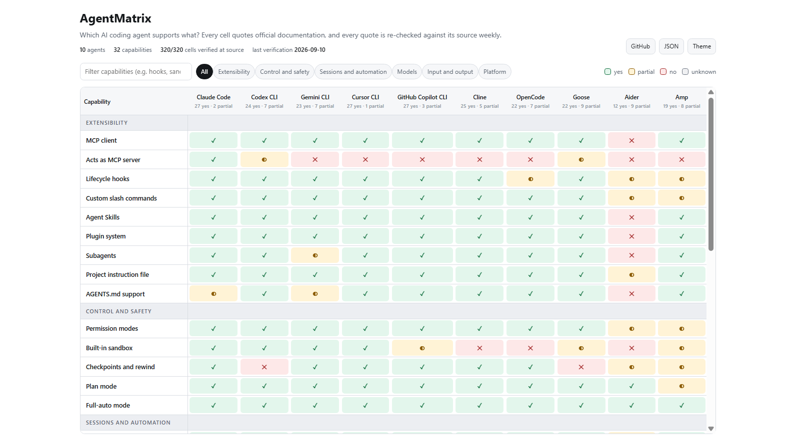

<h1 align="center">AgentMatrix</h1>

<p align="center"><b>Which AI coding agent supports what?</b><br>Every cell quotes the vendor's own documentation. Every quote is re-checked against its source weekly, and cells are re-derived with Claude by anyone with an API key when the documentation changes.</p>

<p align="center">
  <a href="https://barbarkaragul-oss.github.io/agentmatrix/">Interactive matrix</a> ·
  <a href="docs/matrix.json">Raw JSON</a> ·
  <a href="#contributing">Add an agent</a> ·
  <a href="#how-it-works">How it works</a> ·
  <a href="https://barbaros.dev/agentmatrix/">Write-up</a>
</p>

<p align="center">
  <a href="https://github.com/barbarkaragul-oss/agentmatrix/actions/workflows/ci.yml"></a>
  <a href="https://github.com/barbarkaragul-oss/agentmatrix/actions/workflows/weekly.yml"></a>
  
</p>

<p align="center">
  <a href="https://barbarkaragul-oss.github.io/agentmatrix/"></a>
</p>

<!-- stats:start -->
**18 agents × 32 capabilities · 556/576 cells verified against their source · last verification 2026-09-13** · ✅ 387 · 🟡 91 · ❌ 78 · ❔ 20
<!-- stats:end -->

"Does Codex CLI have hooks? Can Gemini CLI act as an MCP server? Which of these run natively on Windows?" Answers to questions like these are usually given from memory, and comparison tables are rarely dated or sourced. This repository answers from the documentation, and shows its work:

- **Every value has a receipt.** Each cell stores the sentence from the vendor's documentation that justifies it, the URL of that page, and the date the sentence was last found there. On the [interactive site](https://barbarkaragul-oss.github.io/agentmatrix/) click any cell to read it; in the tables below hover a cell for the quote and click to open the source.
- **Quotes are re-checked every week, for free.** A GitHub Action re-fetches every source page and searches for every quote. A quote that has disappeared demotes its cell to *unknown* and opens an issue. That catches rewritten or removed documentation; it cannot catch a feature that was removed while an old changelog entry still describes it, which is what the rubric, human review and the wrong-cell issues are for. Matching tolerates formatting differences (whitespace, capitalisation, punctuation, smart quotes, markdown emphasis, inline HTML tags), not wording differences.
- **Cells are re-derived by Claude, on demand.** When documentation changes, a maintainer or contributor runs the pipeline with their own API key: Claude reads the agent's documentation in one request, decides every capability against a written rubric, and returns a quote per cell that is then verified mechanically. Humans review the resulting pull request row by row.

The mechanical check proves that a sentence exists on a page. Whether the sentence supports the value is a judgment made by the rubric, the model, and the reviewers, in that order. Cells are open to challenge: [report one](https://github.com/barbarkaragul-oss/agentmatrix/issues/new?template=wrong-cell.yml) with a link to the docs.

One cell, in full, as stored in [`data/matrix.json`](data/matrix.json):

```json
{
  "agent": "gemini-cli",
  "capability": "sandbox",
  "value": "yes",
  "quote": "Lightweight, built-in sandboxing using `sandbox-exec`.",
  "evidence_url": "https://raw.githubusercontent.com/google-gemini/gemini-cli/main/docs/cli/sandbox.md",
  "notes": "Built-in sandbox enabled with -s/--sandbox or GEMINI_SANDBOX: macOS Seatbelt (sandbox-exec profiles), Docker/Podman containers, a Windows Native sandbox (icacls low integrity level), and gVisor/runsc on Linux.",
  "confidence": "high",
  "verified": true,
  "verified_at": "2026-09-10"
}
```

## Why not a hand-maintained table?

Hand-curated comparisons such as [coding-agents-matrix](https://github.com/PackmindHub/coding-agents-matrix) and the many blog round-ups are useful, and some cover more products than this repository does. The difference is what backs each cell. Here every value comes with the sentence from the vendor's own documentation that justifies it, that sentence is re-checked against the live page every week, and the values follow a public rubric that anyone can argue with. Fewer agents, but every cell has a receipt.

This project is independent: it is not affiliated with Anthropic or with any of the vendors in the table. Claude, the model used to re-derive cells, is made by the vendor of the first column. Two things limit what that can do to the data: the model only proposes cells whose quotes are then verified mechanically, and every change lands through a pull request that a person reviews against the source. If you still see bias in a cell, the rubric and the quote are right there to be challenged.

## The matrix

<!-- matrix:start -->
Legend: ✅ yes · 🟡 partial · ❌ no · ❔ unknown. On desktop, hover a cell for the quote (for ❌ cells, the explanation); click it to open the source. On mobile, use the [interactive matrix](https://barbarkaragul-oss.github.io/agentmatrix/).

### Extensibility

| Capability | Claude Code | Codex CLI | Gemini CLI | Cursor CLI | GitHub Copilot CLI | Cline | OpenCode | Goose | Aider | Amp | Qwen Code | Crush | OpenHands CLI | Continue CLI | Amazon Q Developer CLI | Auggie | Factory Droid CLI | Plandex |
|---|:---:|:---:|:---:|:---:|:---:|:---:|:---:|:---:|:---:|:---:|:---:|:---:|:---:|:---:|:---:|:---:|:---:|:---:|
| **MCP client** | [✅](https://code.claude.com/docs/en/mcp.md "MCP servers give Claude Code access to your tools, databases, and APIs.") | [✅](https://learn.chatgpt.com/docs/codex/cli "Add local or remote MCP servers, authenticate when needed, and inspect the tools available to the current session before Codex uses them.") | [✅](https://raw.githubusercontent.com/google-gemini/gemini-cli/main/docs/tools/mcp-server.md "Gemini CLI supports three MCP transport types:") | [✅](https://cursor.com/docs/cli/mcp "The Cursor CLI supports Model Context Protocol (MCP) servers, allowing you to connect external tools and data sources to agent.") | [✅](https://docs.github.com/en/copilot/how-tos/copilot-cli/customize-copilot/add-mcp-servers "You can connect MCP servers to GitHub Copilot CLI to give Copilot access to external tools, data sources, and services.") | [✅](https://docs.cline.bot/mcp/mcp-overview.md "MCP (Model Context Protocol) lets Cline use external tools and data sources through MCP servers.") | [✅](https://raw.githubusercontent.com/anomalyco/opencode/dev/packages/web/src/content/docs/mcp-servers.mdx "You can add external tools to OpenCode using the _Model Context Protocol_, or MCP. OpenCode supports both local and remote servers.") | [✅](https://raw.githubusercontent.com/aaif-goose/goose/main/documentation/docs/getting-started/using-extensions.md "You can install any MCP server as a goose extension.") | [❌](https://raw.githubusercontent.com/Aider-AI/aider/main/README.md "No MCP (Model Context Protocol) support appears anywhere in the docs site pages fetched, the README, or HISTORY.md through the current main branch; aider's only external tool surf…") | [✅](https://ampcode.com/docs/cli/settings "Model Context Protocol servers that expose tools. See the MCP documentation.") | [✅](https://raw.githubusercontent.com/QwenLM/qwen-code/main/docs/users/features/mcp.md "Qwen Code can connect to external tools and data sources through the Model Context Protocol (MCP).") | [✅](https://raw.githubusercontent.com/charmbracelet/crush/main/README.md "add capabilities via MCPs (http, stdio, and sse)") | [✅](https://docs.openhands.dev/openhands/usage/cli/mcp-servers.md "The agent will automatically have access to tools provided by enabled MCP servers.") | [✅](https://raw.githubusercontent.com/continuedev/continue/main/docs/guides/cli.mdx "cn supports MCP tools, which can be configured in the same way as with the Continue IDE extensions.") | [✅](https://docs.aws.amazon.com/amazonq/latest/qdeveloper-ug/qdev-mcp.md "Amazon Q Developer CLI supports both local MCP servers (that run as processes) and remote MCP servers (that communicate over HTTP).") | [✅](https://docs.augmentcode.com/cli/integrations.md "MCP servers enable Auggie to interact with external tools and services through a standardized protocol, such as accessing databases, running browser automation, sending messages t…") | [✅](https://docs.factory.ai/harness/mcp.md "Model Context Protocol (MCP) servers extend Droid's capabilities with extra tools and context.") | [❌](https://raw.githubusercontent.com/plandex-ai/plandex/main/docs/docs/models/custom-models.md "The docs and full CLI reference contain no mention of MCP; the documented extension surface is models, providers and model packs only.") |
| **Acts as MCP server** | [✅](https://code.claude.com/docs/en/mcp.md "You can use Claude Code itself as an MCP server that other applications can connect to:") | [❌](https://learn.chatgpt.com/docs/developer-commands?surface=cli "The command reference now says codex mcp-server and the standalone binary have been removed; the replacement codex app-server (Experimental) speaks its own protocol over stdio, We…") | [❌](https://raw.githubusercontent.com/google-gemini/gemini-cli/main/docs/cli/acp-mode.md "The only documented server-style mode is gemini --acp (Agent Client Protocol over stdio JSON-RPC for IDEs), not MCP. The CLI subcommand reference (gemini mcp/extensions/gemma/skil…") | [❌](https://cursor.com/docs/cli/mcp "No documented way to expose the CLI as an MCP server. The CLI can be driven by other clients only via agent acp (Agent Client Protocol over stdio/JSON-RPC), which is a different p…") | [❌](https://docs.github.com/en/copilot/reference/copilot-cli-reference/acp-server "No MCP serve mode is documented anywhere in the command reference; the CLI can be exposed to other clients only via the Agent Client Protocol (copilot --acp, public preview), whic…") | [❌](https://docs.cline.bot/mcp/mcp-overview.md "The MCP docs, CLI reference and READMEs only describe Cline as an MCP client; no serve/expose mode is documented. Cline can be driven by editors via --acp (Agent Client Protocol),…") | [❌](https://raw.githubusercontent.com/anomalyco/opencode/dev/packages/web/src/content/docs/cli.mdx "OpenCode exposes itself via an HTTP/OpenAPI server (opencode serve) and an ACP server (opencode acp), but no documented mode serves its tools over MCP.") | [🟡](https://raw.githubusercontent.com/aaif-goose/goose/main/documentation/docs/getting-started/using-extensions.md "goose's built-in extensions are MCP servers in their own right.") | [❌](https://aider.chat/docs/scripting.html "No serve/MCP-server mode is documented; the only programmatic surfaces are the --message CLI mode and an unofficial Python API.") | [❌](https://ampcode.com/docs/customize/mcp "The MCP docs, CLI docs, SDK page, and news only describe Amp as an MCP client; no serve/MCP-server mode for exposing Amp's tools to other clients is documented.") | ❔ | [❌](https://raw.githubusercontent.com/charmbracelet/crush/main/README.md "Crush is an MCP client that connects to servers; no documented mode exposes Crush itself as an MCP server (crush serve uses Crush's own HTTP/SSE protocol for its TUI clients).") | [❌](https://docs.openhands.dev/openhands/usage/cli/ide/overview.md "The CLI can expose itself as an Agent Client Protocol (ACP) server for IDEs, but not as an MCP server.") | ❔ | [❌](https://docs.aws.amazon.com/amazonq/latest/qdeveloper-ug/qdev-mcp.md "MCP is documented only in the client direction; the q mcp subcommands are add, remove, list, import and status, with no serve mode exposing the CLI to other clients.") | [✅](https://docs.augmentcode.com/cli/reference.md "Run Auggie as an MCP server to expose the codebase-retrieval tool to external AI tools like Claude Code, Cursor, and others.") | [❌](https://docs.factory.ai/sdk/typescript.md "Docs describe Droid only as an MCP client; embedding Droid in other apps is documented via the SDK, daemon and ACP, not an MCP server mode.") | [❌](https://raw.githubusercontent.com/plandex-ai/plandex/main/docs/docs/cli-reference.md "The complete command reference lists no serve or MCP-server command, and MCP appears nowhere in the repo or docs.") |
| **Lifecycle hooks** | [✅](https://code.claude.com/docs/en/hooks.md "Claude Code runs hooks at specific points during a session. When an event fires and a matcher matches, Claude Code passes JSON context about the event to your hook handler.") | [✅](https://learn.chatgpt.com/docs/hooks "Hooks are an extensibility framework for Codex.") | [✅](https://raw.githubusercontent.com/google-gemini/gemini-cli/main/docs/hooks/reference.md "Hooks are defined in settings.json within the hooks object.") | [✅](https://cursor.com/docs/hooks "Hooks let you observe, control, and extend the agent loop using custom scripts. Define hooks in hooks.json files at the project or user level, or install them through plugins from…") | [✅](https://docs.github.com/en/copilot/how-tos/copilot-cli/customize-copilot/use-hooks "Hooks allow you to extend and customize the behavior of GitHub Copilot agents by executing custom shell commands at key points during agent execution.") | [✅](https://raw.githubusercontent.com/cline/cline/main/.clinerules/hooks/README.md "Cline hooks allow you to execute custom scripts at specific points in the agentic workflow.") | [🟡](https://raw.githubusercontent.com/anomalyco/opencode/dev/packages/web/src/content/docs/plugins.mdx "Plugins allow you to extend OpenCode by hooking into various events and customizing behavior.") | [✅](https://raw.githubusercontent.com/aaif-goose/goose/main/documentation/docs/guides/context-engineering/hooks.md "Hooks let you run your own scripts when key events happen during a goose session.") | [🟡](https://aider.chat/docs/usage/lint-test.html "You can configure aider to run your test suite after each time the AI edits your code using the --test-cmd <test-command> and --auto-test switch.") | [🟡](https://ampcode.com/docs/customize/plugins "session.start fires when Amp starts a thread session, such as when the user sends the first message in a new thread or opens/switches to an existing thread.") | [✅](https://raw.githubusercontent.com/QwenLM/qwen-code/main/docs/users/features/hooks.md "Hooks allow users to execute custom scripts or programs at specific points in the application lifecycle, such as before tool execution, after tool execution, at session start/end,…") | [🟡](https://raw.githubusercontent.com/charmbracelet/crush/main/README.md "Crush has preliminary support for hooks.") | [✅](https://docs.openhands.dev/openhands/usage/customization/hooks.md "Use the /skills command in the CLI to see loaded skills, hooks, and MCPs for the current session.") | ❔ | [✅](https://raw.githubusercontent.com/aws/amazon-q-developer-cli/main/docs/hooks.md "Hooks allow you to execute custom commands at specific points during agent lifecycle and tool execution.") | [✅](https://docs.augmentcode.com/cli/hooks.md "Hooks allow you to intercept tool execution at specific lifecycle events and run custom scripts.") | [✅](https://docs.factory.ai/harness/hooks.md "Run deterministic shell commands at Droid lifecycle events for validation, policy, context injection, and automation.") | [❌](https://raw.githubusercontent.com/plandex-ai/plandex/main/docs/docs/core-concepts/configuration.md "Configuration covers autonomy, execution and git settings; no user scripts can be attached to lifecycle events.") |
| **Custom slash commands** | [✅](https://code.claude.com/docs/en/skills.md "A file at .claude/commands/deploy.md and a skill at .claude/skills/deploy/SKILL.md both create /deploy and work the same way.") | [✅](https://learn.chatgpt.com/docs/build-skills "In Codex CLI or the IDE extension, run /skills or type $ to mention a skill.") | [✅](https://raw.githubusercontent.com/google-gemini/gemini-cli/main/docs/cli/custom-commands.md "- A file at ~/.gemini/commands/test.toml becomes the command /test.") | [✅](https://cursor.com/docs/skills "Set disable-model-invocation: true to make a skill behave like a traditional slash command, where it is only included in context when you explicitly type /skill-name in chat.") | [❌](https://github.com/github/copilot-cli/issues/1113 "The official CLI reference lists only built-in slash commands; user-defined markdown commands are an open feature request (issue #1113), not a shipped feature.") | [✅](https://docs.cline.bot/core-workflows/using-commands.md "Any enabled skill can be triggered this way, which gives you a fast path to skill-specific guidance without rewriting the same instructions each time.") | [✅](https://raw.githubusercontent.com/anomalyco/opencode/dev/packages/web/src/content/docs/commands.mdx "Create markdown files in the commands/ directory to define custom commands.") | [✅](https://raw.githubusercontent.com/aaif-goose/goose/main/documentation/docs/guides/context-engineering/slash-commands.md "Configure slash commands in your configuration file. List the command (without the leading /) along with the path to the recipe file on your computer:") | [🟡](https://aider.chat/docs/config/options.html "Load and execute /commands from a file on launch") | [🟡](https://ampcode.com/docs/customize/skills "Project skills are saved under .agents/skills/ and can be committed with the project.") | [✅](https://raw.githubusercontent.com/QwenLM/qwen-code/main/docs/users/features/commands.md "Custom commands now use Markdown format with optional YAML frontmatter. TOML format is deprecated but still supported for backwards compatibility.") | [✅](https://raw.githubusercontent.com/charmbracelet/crush/main/README.md "Skills can be made invocable as commands from the commands palette") | [🟡](https://docs.openhands.dev/overview/plugins.md "Custom slash commands for plugin functionality") | [✅](https://raw.githubusercontent.com/continuedev/continue/main/docs/customize/deep-dives/prompts.mdx "Explain that when invokable is set to true, a slash command becomes available in the IDE extensions and CLI") | [✅](https://raw.githubusercontent.com/aws/amazon-q-developer-cli/main/crates/chat-cli/src/cli/chat/cli/prompts.rs "Prompts are reusable templates that help you quickly access common workflows and tasks.") | [✅](https://docs.augmentcode.com/cli/custom-commands.md "Custom slash commands let you create reusable prompts stored as Markdown files that Auggie can run.") | [✅](https://docs.factory.ai/harness/custom-slash-commands.md "Droid scans .factory/commands folders and turns each registered file into a command.") | [🟡](https://raw.githubusercontent.com/plandex-ai/plandex/main/docs/docs/repl.md "- /run or /r plus a relative file path for using a file as a prompt") |
| **Agent Skills** | [✅](https://code.claude.com/docs/en/skills.md "Skills extend what Claude can do. Create a SKILL.md file with instructions, and Claude adds it to its toolkit.") | [✅](https://learn.chatgpt.com/docs/build-skills "Codex reads skills from repository, user, admin, and system locations.") | [✅](https://raw.githubusercontent.com/google-gemini/gemini-cli/main/docs/cli/skills.md "The SKILL.md body and folder structure is added to the conversation history.") | [✅](https://cursor.com/docs/skills "When Cursor starts, it automatically discovers skills from skill directories and makes them available to Agent.") | [✅](https://docs.github.com/en/copilot/how-tos/copilot-cli/customize-copilot/add-skills "To create an agent skill, you write a SKILL.md file and, optionally, other resources, such as supplementary Markdown files, or scripts, which you reference in the SKILL.md instruc…") | [✅](https://docs.cline.bot/customization/skills.md "Every skill is a directory containing a SKILL.md file with YAML frontmatter.") | [✅](https://raw.githubusercontent.com/anomalyco/opencode/dev/packages/web/src/content/docs/skills.mdx "Create one folder per skill name and put a SKILL.md inside it.") | [✅](https://raw.githubusercontent.com/aaif-goose/goose/main/documentation/docs/guides/context-engineering/using-skills.md "A SKILL.md file requires YAML frontmatter with name and description, followed by the skill content:") | [❌](https://aider.chat/docs/usage/conventions.html "No SKILL.md or equivalent skills format; guidance is provided only via plain conventions/markdown files added to the chat with /read.") | [✅](https://ampcode.com/docs/customize/skills "Project skills are saved under .agents/skills/ and can be committed with the project.") | [✅](https://raw.githubusercontent.com/QwenLM/qwen-code/main/docs/users/features/skills.md "This guide shows you how to create, use, and manage Agent Skills in Qwen Code.") | [✅](https://raw.githubusercontent.com/charmbracelet/crush/main/README.md "Crush supports the Agent Skills open standard for") | [✅](https://docs.openhands.dev/overview/skills.md "OpenHands supports the Agent Skills specification and adds optional features such as keyword triggers and path-triggered rules.") | ❔ | [❌](https://raw.githubusercontent.com/aws/amazon-q-developer-cli/main/docs/agent-format.md "No SKILL.md or Agent Skills loader is documented; the nearest equivalent is agent JSON files plus file resources and .amazonq/rules markdown.") | [✅](https://docs.augmentcode.com/cli/skills.md "Skills provide a standardized way to give Auggie specialized domain knowledge and capabilities.") | [✅](https://docs.factory.ai/harness/skills.md "Create reusable SKILL.md workflows that Droid can discover, invoke, and share across projects.") | [❌](https://raw.githubusercontent.com/plandex-ai/plandex/main/docs/docs/core-concepts/context-management.md "No SKILL.md format or equivalent modular skill package; reusable guidance is loaded as ordinary context or notes.") |
| **Plugin system** | [✅](https://code.claude.com/docs/en/discover-plugins.md "Plugins extend Claude Code with skills, agents, hooks, and MCP servers. Plugin marketplaces are catalogs that help you discover and install these extensions without building them …") | [✅](https://learn.chatgpt.com/docs/developer-commands?surface=cli "Install, list, and remove plugins from configured marketplace sources.") | [✅](https://raw.githubusercontent.com/google-gemini/gemini-cli/main/docs/extensions/reference.md "gemini extensions install <source> [--ref <ref>] [--auto-update] [--pre-release] [--consent] [--skip-settings]") | [✅](https://cursor.com/docs/plugins "Plugins package rules, skills, agents, commands, MCP servers, and hooks into distributable bundles.") | [✅](https://docs.github.com/en/copilot/how-tos/copilot-cli/customize-copilot/plugins-finding-installing "Plugins are packages that extend the functionality of Copilot CLI. You can install a plugin from a marketplace that you have registered with the CLI.") | [✅](https://docs.cline.bot/customization/plugins.md "Plugins extend Cline with custom tools, lifecycle hooks, slash commands, and more. They can be installed globally (available in all sessions) or per-project.") | [✅](https://raw.githubusercontent.com/anomalyco/opencode/dev/packages/web/src/content/docs/plugins.mdx "npm plugins are installed automatically using Bun at startup. Packages and their dependencies are cached in ~/.cache/opencode/node_modules/.") | [✅](https://raw.githubusercontent.com/aaif-goose/goose/main/documentation/docs/guides/context-engineering/plugins.md "The install command clones the repository, detects the plugin format, copies it into the plugins directory, and reports the imported components.") | [❌](https://aider.chat/docs/install/optional.html "Aider has no plugin/extension format or install mechanism of its own; the docs only point to third-party editor plugins that wrap aider.") | [✅](https://ampcode.com/docs/customize/plugins "To install a single-file plugin from a URL for all projects on your machine, run:") | [✅](https://raw.githubusercontent.com/QwenLM/qwen-code/main/docs/users/extension/introduction.md "Qwen Code extensions package prompts, MCP servers, subagents, skills and custom commands into a familiar and user-friendly format.") | [❌](https://raw.githubusercontent.com/charmbracelet/crush/main/README.md "Extensibility is via MCP servers, Agent Skills, and (preliminary) hooks; no unified plugin package that bundles these together is documented.") | [✅](https://docs.openhands.dev/overview/plugins.md "openhands --plugin /path/to/plugin") | [🟡](https://raw.githubusercontent.com/continuedev/continue/main/docs/cli/quickstart.mdx "| --agent <slug> | Load an agent file by slug |") | [❌](https://raw.githubusercontent.com/aws/amazon-q-developer-cli/main/docs/agent-format.md "An agent file can bundle MCP servers, hooks, tools and a prompt, but there is no installable plugin or extension system or marketplace for the CLI.") | [✅](https://docs.augmentcode.com/cli/plugins.md "Auggie supports a plugin system that allows you to extend its functionality with custom commands, subagents, rules, hooks, skills, and MCP server integrations.") | [✅](https://docs.factory.ai/harness/plugins.md "Use and build shareable Droid packages for skills, commands, droids, output styles, hooks, and MCP servers.") | [❌](https://raw.githubusercontent.com/plandex-ai/plandex/main/docs/docs/models/custom-models.md "Extensibility is limited to model/provider/model-pack JSON; there is no plugin or extension bundle system.") |
| **Subagents** | [✅](https://code.claude.com/docs/en/sub-agents.md "Each subagent runs in its own context window with a custom system prompt, specific tool access, and independent permissions.") | [✅](https://learn.chatgpt.com/docs/agent-configuration/subagents "Current Codex releases enable subagent workflows by default.") | [🟡](https://raw.githubusercontent.com/google-gemini/gemini-cli/main/docs/extensions/reference.md "Sub-agents are a preview feature currently under active development.") | [✅](https://cursor.com/docs/subagents "Each subagent operates in its own context window, handles specific types of work, and returns its result to the parent agent.") | [✅](https://docs.github.com/en/copilot/concepts/agents/copilot-cli/about-custom-agents "One of the benefits of using custom agents you have defined yourself—or the built-in agents—is that the main Copilot agent can run them as subagents with a separate context window.") | [✅](https://raw.githubusercontent.com/cline/cline/main/README.md "A coordinator agent breaks the work into subtasks and delegates to specialist agents, each with their own tools and context.") | [✅](https://raw.githubusercontent.com/anomalyco/opencode/dev/packages/web/src/content/docs/agents.mdx "Subagents are specialized assistants that primary agents can invoke for specific tasks. You can also manually invoke them by @ mentioning them in your messages.") | [✅](https://raw.githubusercontent.com/aaif-goose/goose/main/documentation/docs/guides/context-engineering/subagents.mdx "Subagents are independent instances that execute tasks while keeping your main conversation clean and focused.") | [❌](https://aider.chat/docs/usage/modes.html "Architect mode uses a second 'editor' model for a single request, but there is no delegation to subagents with their own context.") | [✅](https://ampcode.com/docs/models-and-subagents "Amp can delegate focused work to specialist subagents. Each subagent has its own context window and access to tools like file editing and terminal commands.") | [✅](https://raw.githubusercontent.com/QwenLM/qwen-code/main/docs/users/features/sub-agents.md "Subagents are specialized AI assistants that handle specific types of tasks within Qwen Code.") | [✅](https://raw.githubusercontent.com/charmbracelet/crush/main/internal/agent/templates/agent_tool.md "Launch a new agent that has access to the following tools: glob, grep, ls, view.") | [🟡](https://docs.openhands.dev/overview/plugins.md "Specialized agent definitions for specific tasks") | ❔ | [🟡](https://raw.githubusercontent.com/aws/amazon-q-developer-cli/main/docs/experiments.md "Enables running Q chat sessions with specific agents in parallel to your main conversation.") | [✅](https://docs.augmentcode.com/cli/subagents.md "Subagents have their own context window independent from the main agent") | [✅](https://docs.factory.ai/harness/subagents.md "Define specialized subagents with their own system prompt, model, and tool policy that Droid delegates focused tasks to in a fresh context window.") | [🟡](https://raw.githubusercontent.com/plandex-ai/plandex/main/docs/docs/models/roles.md "Plandex has multiple roles that are used for different aspects of its functionality.") |
| **Project instruction file** | [✅](https://code.claude.com/docs/en/memory.md "CLAUDE.md files are markdown files that give Claude persistent instructions for a project, your personal workflow, or your entire organization. You write these files in plain text…") | [✅](https://learn.chatgpt.com/docs/agent-configuration/agents-md "Codex reads AGENTS.md files before doing any work.") | [✅](https://raw.githubusercontent.com/google-gemini/gemini-cli/main/docs/cli/gemini-md.md "Context files, which use the default name GEMINI.md, are a powerful feature for providing instructional context to the Gemini model.") | [✅](https://cursor.com/docs/cli/using "The CLI agent supports the same rules system as the editor. You can create rules in the .cursor/rules directory to provide context and guidance to the agent.") | [✅](https://docs.github.com/en/copilot/how-tos/copilot-cli/customize-copilot/add-custom-instructions "Instead of repeatedly adding this contextual detail to your prompts, you can create custom instructions that automatically add this information for you.") | [✅](https://docs.cline.bot/customization/cline-rules.md "Workspace rules go in .clinerules/ at your project root.") | [✅](https://raw.githubusercontent.com/anomalyco/opencode/dev/packages/web/src/content/docs/rules.mdx "You can provide custom instructions to opencode by creating an AGENTS.md file. This is similar to Cursor's rules.") | [✅](https://raw.githubusercontent.com/aaif-goose/goose/main/documentation/docs/guides/context-engineering/using-goosehints.md "By default, goose looks for both AGENTS.md and .goosehints at each level.") | [🟡](https://aider.chat/docs/usage/conventions.html "You can also configure aider to always load your conventions file in the .aider.conf.yml config file") | [✅](https://ampcode.com/docs/customize/agents-md "Amp looks in AGENTS.md files for guidance on codebase structure, build/test commands, and conventions.") | [✅](https://raw.githubusercontent.com/QwenLM/qwen-code/main/docs/users/features/memory.md "QWEN.md — instructions _you_ write once and Qwen reads every session") | [✅](https://raw.githubusercontent.com/charmbracelet/crush/main/README.md "When you initialize a project, Crush analyzes your codebase and creates") | [✅](https://docs.openhands.dev/openhands/usage/customization/repository.md "You can customize how OpenHands interacts with your repository by creating a .openhands directory at the root level.") | [✅](https://raw.githubusercontent.com/continuedev/continue/main/docs/cli/tui-mode.mdx "| /init | Create an AGENTS.md file for the current project |") | [✅](https://raw.githubusercontent.com/aws/amazon-q-developer-cli/main/docs/default-agent-behavior.md "- .amazonq/rules/**/*.md - Any markdown files in the .amazonq/rules/ directory and subdirectories") | [✅](https://docs.augmentcode.com/cli/rules.md "Auggie automatically loads custom rules and guidelines from several file locations to provide context-aware assistance.") | [✅](https://docs.factory.ai/harness/agents-md.md "Give Droid durable project instructions, commands, and guardrails with AGENTS.md.") | [❌](https://raw.githubusercontent.com/plandex-ai/plandex/main/docs/docs/core-concepts/context-management.md "Standing instructions are loaded manually as notes; no auto-read project instruction file is documented (the .plandex directory holds light project config only).") |
| **AGENTS.md support** | [🟡](https://code.claude.com/docs/en/memory.md "Claude Code reads CLAUDE.md, not AGENTS.md. If your repository already uses AGENTS.md for other coding agents, create a CLAUDE.md that imports it so both tools read the same instr…") | [✅](https://learn.chatgpt.com/docs/agent-configuration/agents-md "Codex reads AGENTS.md files before doing any work.") | [🟡](https://raw.githubusercontent.com/google-gemini/gemini-cli/main/docs/cli/gemini-md.md "While GEMINI.md is the default filename, you can configure this in your settings.json file. To specify a different name or a list of names, use the context.fileName property.") | [✅](https://cursor.com/docs/cli/using "The CLI also reads AGENTS.md and CLAUDE.md at the project root") | [✅](https://docs.github.com/en/copilot/how-tos/copilot-cli/customize-copilot/add-custom-instructions "Agent instructions, discovered in the standard locations. For more information, see the agentsmd/agents.md repository.") | [✅](https://docs.cline.bot/customization/cline-rules.md "Cline also reads cross-tool global AGENTS instructions from ~/.agents/AGENTS.md.") | [✅](https://raw.githubusercontent.com/anomalyco/opencode/dev/packages/web/src/content/docs/rules.mdx "Place an AGENTS.md in your project root for project-specific rules. These only apply when you are working in this directory or its sub-directories.") | [✅](https://raw.githubusercontent.com/aaif-goose/goose/main/documentation/docs/guides/context-engineering/using-goosehints.md "goose looks for AGENTS.md then .goosehints files by default, but you can configure a different filename or multiple context files using the CONTEXT_FILE_NAMES environment variable.") | [❌](https://aider.chat/docs/usage/conventions.html "AGENTS.md is not mentioned in any fetched doc page, README, or HISTORY.md; only user-chosen conventions files via --read/config.") | [✅](https://ampcode.com/docs/customize/agents-md "AGENTS.md files in the current working directory (or editor workspace roots) and parent directories (up to $HOME) are always included.") | [✅](https://raw.githubusercontent.com/QwenLM/qwen-code/main/docs/users/features/memory.md "If your repository already has an AGENTS.md file for other AI tools, Qwen reads that too. No need to duplicate instructions.") | [✅](https://raw.githubusercontent.com/charmbracelet/crush/main/README.md "this file is named AGENTS.md") | [✅](https://docs.openhands.dev/overview/skills.md "Use AGENTS.md for short, repository-wide conventions.") | [✅](https://raw.githubusercontent.com/continuedev/continue/main/docs/cli/tui-mode.mdx "| /init | Create an AGENTS.md file for the current project |") | [❌](https://raw.githubusercontent.com/aws/amazon-q-developer-cli/main/docs/default-agent-behavior.md "The default context files are AmazonQ.md, README.md and .amazonq/rules markdown; AGENTS.md is not read unless a user adds it manually to an agent resources list.") | [✅](https://docs.augmentcode.com/cli/rules.md "When you work on a file, Augment looks for AGENTS.md and CLAUDE.md in the file's directory") | [✅](https://docs.factory.ai/harness/agents-md.md "Use AGENTS.md for new guidance. Droid also reads compatible filenames so existing instruction files from other coding tools keep working.") | [❌](https://raw.githubusercontent.com/plandex-ai/plandex/main/docs/docs/core-concepts/context-management.md "AGENTS.md is not mentioned anywhere in the docs or repo; context is whatever the user or auto-context loads.") |

### Control and safety

| Capability | Claude Code | Codex CLI | Gemini CLI | Cursor CLI | GitHub Copilot CLI | Cline | OpenCode | Goose | Aider | Amp | Qwen Code | Crush | OpenHands CLI | Continue CLI | Amazon Q Developer CLI | Auggie | Factory Droid CLI | Plandex |
|---|:---:|:---:|:---:|:---:|:---:|:---:|:---:|:---:|:---:|:---:|:---:|:---:|:---:|:---:|:---:|:---:|:---:|:---:|
| **Permission modes** | [✅](https://code.claude.com/docs/en/cli-reference.md "Accepts default, acceptEdits, plan, auto, dontAsk, bypassPermissions, or manual as an alias for default.") | [✅](https://learn.chatgpt.com/docs/developer-commands?surface=cli "Relax or tighten approval requirements mid-session, such as switching between Auto and Read Only.") | [✅](https://raw.githubusercontent.com/google-gemini/gemini-cli/main/docs/cli/cli-reference.md "Approval mode for tool execution. Choices: default, auto_edit, yolo, plan") | [✅](https://cursor.com/docs/cli/reference/configuration "Approval mode: allowlist, auto-review, or unrestricted") | [✅](https://docs.github.com/en/copilot/reference/copilot-cli-reference/cli-command-reference "Switch between permission modes (default, assisted, allow-all), or show the current mode (show). This is the canonical command for permission mode changes; /allow-all and /yolo re…") | [✅](https://docs.cline.bot/features/auto-approve.md "Auto Approve lets you decide which actions Cline can take without prompting you each time.") | [✅](https://raw.githubusercontent.com/anomalyco/opencode/dev/packages/web/src/content/docs/permissions.mdx "OpenCode uses the permission config to decide whether a given action should run automatically, prompt you, or be blocked.") | [✅](https://raw.githubusercontent.com/aaif-goose/goose/main/documentation/docs/guides/goose-cli-commands.md "Set the goose mode to use ('auto', 'approve', 'chat', 'smart_approve')") | [🟡](https://aider.chat/docs/config/options.html "Always say yes to every confirmation") | [🟡](https://ampcode.com/docs/tools "Amp does not ask for approval before running tools. Use a custom plugin to control tool use.") | [✅](https://raw.githubusercontent.com/QwenLM/qwen-code/main/docs/users/features/approval-mode.md "Qwen Code offers five distinct permission modes that allow you to flexibly control how AI interacts with your code and system based on task complexity and risk level.") | [✅](https://raw.githubusercontent.com/charmbracelet/crush/main/README.md "By default, Crush will ask you for permission before running tool calls.") | [✅](https://docs.openhands.dev/openhands/usage/cli/command-reference.md "Use LLM-based security analyzer for action approval") | [✅](https://raw.githubusercontent.com/continuedev/continue/main/docs/cli/tool-permissions.mdx "Modes are a shorthand for common permission sets. Switch modes with Shift+Tab during a TUI session, or set them at launch:") | [✅](https://raw.githubusercontent.com/aws/amazon-q-developer-cli/main/docs/built-in-tools.md "If a tool is not in the allowedTools list, the user will be prompted for permission when the tool is used unless an allowed toolSettings configuration is set.") | [✅](https://docs.augmentcode.com/cli/permissions.md "Auggie CLIs tool permission system provides fine-grained control over what actions the agent can perform in your environment.") | [✅](https://docs.factory.ai/autonomy-and-safety/auto-run.md "Choose Off, Low, Medium, or High to control what Droid can do without repeated confirmations.") | [✅](https://raw.githubusercontent.com/plandex-ai/plandex/main/docs/docs/core-concepts/autonomy.md "Plandex v2 offers multiple levels of autonomy with pre-set config.") |
| **Built-in sandbox** | [✅](https://code.claude.com/docs/en/sandboxing.md "The sandbox is built into Claude Code and runs on macOS, Linux, and WSL2. Native Windows is not supported.") | [✅](https://learn.chatgpt.com/docs/agent-approvals-security "OS-level mechanisms enforce sandbox policies. Defaults include no network access and write permissions limited to the active workspace.") | [✅](https://raw.githubusercontent.com/google-gemini/gemini-cli/main/docs/cli/sandbox.md "Lightweight, built-in sandboxing using sandbox-exec.") | [✅](https://cursor.com/docs/agent/security/run-modes "Cursor uses Seatbelt through sandbox-exec. A generated sandbox profile limits file access, network access, and other process behavior for the full subprocess tree.") | [🟡](https://docs.github.com/en/copilot/concepts/agents/copilot-cli/understanding-local-sandboxing "When you enable local sandboxing, Copilot CLI runs the commands it invokes on your behalf inside an operating-system sandbox.") | [❌](https://raw.githubusercontent.com/cline/cline/main/apps/cli/README.md "The documented 'sandbox mode' (CLINE_SANDBOX, --data-dir) only isolates Cline's own session/state directory; no OS-level filesystem or network isolation for shell commands is docu…") | [❌](https://raw.githubusercontent.com/anomalyco/opencode/dev/packages/web/src/content/docs/index.mdx "No sandbox feature is documented. The Docker image is an install method, not an isolation mechanism; the permission system controls which actions prompt, not OS-level isolation.") | [🟡](https://raw.githubusercontent.com/aaif-goose/goose/main/documentation/docs/tutorials/goose-in-docker.md "The --container flag allows you to run goose extensions inside your Docker containers.") | [❌](https://aider.chat/docs/install/docker.html "No sandbox feature is documented. The Docker images are an install method, not an isolation mechanism; commands run with the user privileges of the shell.") | [🟡](https://ampcode.com/docs/orbs "Orbs are remote machines where Amp agents work without using your computer.") | [✅](https://raw.githubusercontent.com/QwenLM/qwen-code/main/docs/users/features/sandbox.md "This document explains how to run Qwen Code inside a sandbox to reduce risk when tools execute shell commands or modify files.") | [❌](https://raw.githubusercontent.com/charmbracelet/crush/main/README.md "No built-in OS-level filesystem/network sandbox; config runs as trusted code in a full shell and safety relies on permission prompts.") | [🟡](https://docs.openhands.dev/openhands/usage/sandboxes/overview.md "Good isolation from your host machine.") | [❌](https://raw.githubusercontent.com/continuedev/continue/main/docs/cli/tui-mode.mdx "Safety is approval-based; no OS-level filesystem or network sandbox is documented.") | [❌](https://raw.githubusercontent.com/aws/amazon-q-developer-cli/main/docs/built-in-tools.md "Safety comes from approval prompts and allow or deny lists; no OS-level filesystem or network isolation of shell commands is documented.") | [❌](https://docs.augmentcode.com/cli/permissions.md "Protection is rule-based permissions, not OS-level filesystem or network isolation; the vendor's separate Cosmos cloud product runs sessions in a remote sandbox.") | [✅](https://docs.factory.ai/autonomy-and-safety/sandbox.md "All shell commands initiated by Droid run in a separate process that is limited to the filesystem and network boundaries configured by users and enforced at the OS kernel level.") | [❌](https://raw.githubusercontent.com/plandex-ai/plandex/main/docs/docs/core-concepts/autonomy.md "Plandex's 'sandbox' is a pending-diff review buffer for file changes, not OS-level filesystem or network isolation for shell commands.") |
| **Checkpoints and rewind** | [✅](https://code.claude.com/docs/en/checkpointing.md "Claude Code automatically tracks Claude's file edits as you work, allowing you to quickly undo changes and rewind to previous states if anything gets off track.") | [❌](https://learn.chatgpt.com/docs/codex/cli "No automatic checkpoint, snapshot, rewind or undo command over agent edits is documented; the docs advise the user to make their own Git checkpoints, and /diff only shows the work…") | [✅](https://raw.githubusercontent.com/google-gemini/gemini-cli/main/docs/cli/rewind.md "The /rewind command lets you go back to a previous state in your conversation and, optionally, revert any file changes made by the AI during those interactions.") | [✅](https://cursor.com/docs/cli/changelog "An interactive timeline restores files and conversation state to any earlier turn, with per-turn file diffs, conversation-only restore, and /undo//restore aliases (enable in /conf…") | [✅](https://docs.github.com/en/copilot/concepts/agents/copilot-cli/cancel-and-roll-back "As Copilot works, Copilot CLI tracks the file changes it makes as it responds to each prompt.") | [✅](https://docs.cline.bot/core-workflows/checkpoints.md "Cline maintains a shadow Git repository separate from your project's actual Git history.") | [✅](https://raw.githubusercontent.com/anomalyco/opencode/dev/packages/web/src/content/docs/config.mdx "OpenCode uses snapshots to track file changes during agent operations, enabling you to undo and revert changes within a session. Snapshots are enabled by default.") | [❌](https://raw.githubusercontent.com/aaif-goose/goose/main/documentation/docs/guides/file-management.md "No automatic file checkpoints or rewind command; docs tell users to rely on their own Git commits. Message editing/forking rewinds conversation history only, not file changes.") | [🟡](https://aider.chat/docs/usage/commands.html "Undo the last git commit if it was done by aider") | [🟡](https://ampcode.com/docs/cli "Edit files through your IDE, with full undo support") | [✅](https://raw.githubusercontent.com/QwenLM/qwen-code/main/docs/users/features/commands.md "Revert project files to the checkpoint before a tool call ran") | ❔ | ❔ | ❔ | [🟡](https://raw.githubusercontent.com/aws/amazon-q-developer-cli/main/docs/experiments.md "Enables session-scoped checkpoints for tracking file changes using Git CLI commands") | [❌](https://docs.augmentcode.com/cli/interactive.md "The /diffs command views session changes; no rewind, restore or checkpoint feature appears anywhere in the CLI docs or changelog.") | [✅](https://docs.factory.ai/droid-cli/cli-reference.md "Second press clears the input draft; a third Escape opens the rewind menu") | [✅](https://raw.githubusercontent.com/plandex-ai/plandex/main/docs/docs/core-concepts/version-control.md "The plandex apply action can also be undone with plandex rewind.") |
| **Plan mode** | [✅](https://code.claude.com/docs/en/permission-modes.md "Plan mode tells Claude to research and propose changes without making them. Claude reads files, runs shell commands to explore, and writes a plan, but does not edit your source.") | [✅](https://learn.chatgpt.com/docs/developer-commands?surface=cli "Ask Codex to propose an execution plan before implementation work starts.") | [✅](https://raw.githubusercontent.com/google-gemini/gemini-cli/main/docs/cli/plan-mode.md "Plan Mode is a read-only environment for architecting robust solutions before implementation.") | [✅](https://cursor.com/docs/cli/using "Use Plan mode to design your approach before coding. The agent asks clarifying questions to refine your plan.") | [✅](https://docs.github.com/en/copilot/reference/copilot-cli-reference/cli-command-reference "/plan starts a planning session where Copilot CLI can explore and analyze your codebase but is blocked from editing your project files.") | [✅](https://docs.cline.bot/core-workflows/plan-and-act.md "In this mode, Cline can read your codebase, run searches, and discuss strategy, but cannot modify any files or execute commands.") | [✅](https://raw.githubusercontent.com/anomalyco/opencode/dev/packages/web/src/content/docs/agents.mdx "This agent is useful when you want the LLM to analyze code, suggest changes, or create plans without making any actual modifications to your codebase.") | [✅](https://raw.githubusercontent.com/aaif-goose/goose/main/documentation/docs/guides/goose-cli-commands.md "Enter 'plan' mode with optional message. Create a plan based on the current messages and ask user if they want to act on it") | [✅](https://aider.chat/docs/usage/modes.html "Aider will discuss your code and answer questions about it, but never make changes.") | [🟡](https://ampcode.com/docs/prompting "If you want the model to not write any code, but only to research and plan, say so: “Do not edit any files.”") | [✅](https://raw.githubusercontent.com/QwenLM/qwen-code/main/docs/users/features/approval-mode.md "Plan Mode instructs Qwen Code to create a plan by analyzing the codebase with read-only operations") | [❌](https://raw.githubusercontent.com/charmbracelet/crush/main/README.md "No dedicated read-only plan mode; a read-only setup can only be approximated by denying edit/write tools via permissions.") | [❌](https://docs.openhands.dev/openhands/usage/cli/command-reference.md "The command palette can view the agent's plan, but no read-only plan-first mode is documented.") | [✅](https://raw.githubusercontent.com/continuedev/continue/main/docs/cli/quickstart.mdx "| --readonly | Plan mode — read-only tools only |") | [❌](https://raw.githubusercontent.com/aws/amazon-q-developer-cli/main/docs/experiments.md "No read-only planning mode is documented; the closest features are the experimental todo_list tool and restricting the agent to read-only tools via permissions.") | [✅](https://docs.augmentcode.com/cli/interactive.md "Toggle Plan Mode or open the latest plan file") | [✅](https://docs.factory.ai/autonomy-and-safety/specification-mode.md "During Spec Mode, Droid should not edit files, change configuration, make commits, start services, or write to external systems.") | [✅](https://raw.githubusercontent.com/plandex-ai/plandex/main/docs/docs/core-concepts/prompts.md "If you want to ask Plandex questions or chat without generating files or making changes, use the plandex chat command instead of plandex tell.") |
| **Full-auto mode** | [✅](https://code.claude.com/docs/en/cli-reference.md "Skip permission prompts. Equivalent to --permission-mode bypassPermissions.") | [✅](https://learn.chatgpt.com/docs/developer-commands?surface=cli "Run every command without approvals or sandboxing. Only use inside an externally hardened environment.") | [✅](https://raw.githubusercontent.com/google-gemini/gemini-cli/main/docs/reference/configuration.md "- yolo: Automatically approve all tool calls (equivalent to --yolo)") | [✅](https://cursor.com/docs/cli/reference/parameters "Force allow commands unless explicitly denied") | [✅](https://docs.github.com/en/copilot/concepts/agents/copilot-cli/autopilot "The --allow-all and --yolo options allow the CLI agent to use all tools, paths, and URLs. You can also set these permissions during an interactive session, by using the /allow-all…") | [✅](https://docs.cline.bot/features/auto-approve.md "YOLO mode is Auto Approve on steroids. Check the box and Cline auto-approves everything: file changes, terminal commands, browser actions, MCP tools, and mode transitions.") | [✅](https://raw.githubusercontent.com/anomalyco/opencode/dev/packages/web/src/content/docs/permissions.mdx "Start OpenCode with --auto to automatically approve permission requests that are not explicitly denied.") | [✅](https://raw.githubusercontent.com/aaif-goose/goose/main/documentation/docs/mcp/developer-mcp.md "By default, goose can run system commands with your user privileges and edit any accessible file without your approval.") | [✅](https://aider.chat/docs/config/options.html "Always say yes to every confirmation") | [✅](https://ampcode.com/docs/tools "By default, Amp does not ask for approval before running tools.") | [✅](https://raw.githubusercontent.com/QwenLM/qwen-code/main/docs/users/features/approval-mode.md "Use YOLO sparingly**: Only for trusted automation in controlled environments") | [✅](https://raw.githubusercontent.com/charmbracelet/crush/main/README.md "You can also skip all permission prompts completely by running Crush with the") | [✅](https://docs.openhands.dev/openhands/usage/cli/command-reference.md "Auto-approve all actions without confirmation") | [✅](https://raw.githubusercontent.com/continuedev/continue/main/docs/cli/quickstart.mdx "| --auto | Allow all tools without prompting |") | [✅](https://raw.githubusercontent.com/aws/amazon-q-developer-cli/main/crates/chat-cli/src/cli/chat/mod.rs "Allows the model to use any tool to run commands without asking for confirmation.") | [🟡](https://docs.augmentcode.com/cli/overview.md "This mode exits immediately without prompting for additional input.") | [✅](https://docs.factory.ai/droid-cli/cli-reference.md "Skip all permission prompts (use with extreme caution)") | [✅](https://raw.githubusercontent.com/plandex-ai/plandex/main/docs/docs/cli-reference.md "--full: Start the plan with auto-mode 'Full-Auto' (auto-apply, auto-exec, auto-debug).") |

### Sessions and automation

| Capability | Claude Code | Codex CLI | Gemini CLI | Cursor CLI | GitHub Copilot CLI | Cline | OpenCode | Goose | Aider | Amp | Qwen Code | Crush | OpenHands CLI | Continue CLI | Amazon Q Developer CLI | Auggie | Factory Droid CLI | Plandex |
|---|:---:|:---:|:---:|:---:|:---:|:---:|:---:|:---:|:---:|:---:|:---:|:---:|:---:|:---:|:---:|:---:|:---:|:---:|
| **Resume sessions** | [✅](https://code.claude.com/docs/en/cli-reference.md "Resume a specific session by ID or name, or show an interactive picker to choose a session.") | [✅](https://learn.chatgpt.com/docs/developer-commands?surface=cli "Continue a previous interactive session by ID or resume the most recent chat.") | [✅](https://raw.githubusercontent.com/google-gemini/gemini-cli/main/docs/cli/session-management.md "When starting Gemini CLI, use the --resume (or -r) flag to load existing sessions.") | [✅](https://cursor.com/docs/cli/using "Continue from an existing thread with --resume [thread id] to load prior context.") | [✅](https://docs.github.com/en/copilot/reference/copilot-cli-reference/cli-command-reference "Resume a previous interactive session by choosing from a list. Optionally specify a session ID, ID prefix, or session name.") | [✅](https://docs.cline.bot/cli/cli-reference.md "Resume an existing session by ID") | [✅](https://raw.githubusercontent.com/anomalyco/opencode/dev/packages/web/src/content/docs/tui.mdx "List and switch between sessions. _Aliases_: /resume, /continue") | [✅](https://raw.githubusercontent.com/aaif-goose/goose/main/documentation/docs/guides/sessions/session-management.md "Sessions created in goose Desktop can be resumed in the CLI and vice versa. All sessions are stored in the same database.") | [🟡](https://aider.chat/docs/config/options.html "Restore the previous chat history messages (default: False)") | [✅](https://ampcode.com/docs/threads "Run amp threads continue T-… to attach the CLI to a thread, or pick Copy → Sync CLI Command from the More Actions menu to copy the command with the thread ID filled in.") | [✅](https://raw.githubusercontent.com/QwenLM/qwen-code/main/docs/users/features/commands.md "Resume a previous conversation session") | [✅](https://raw.githubusercontent.com/charmbracelet/crush/main/internal/cmd/run.go "Continue a previous session by ID") | [✅](https://docs.openhands.dev/openhands/usage/cli/command-reference.md "Resume a conversation. If no ID provided, lists recent conversations") | [✅](https://raw.githubusercontent.com/continuedev/continue/main/docs/cli/quickstart.mdx "| --resume | Resume the most recent session |") | [✅](https://raw.githubusercontent.com/aws/amazon-q-developer-cli/main/crates/chat-cli/src/cli/chat/mod.rs "Resumes the previous conversation from this directory.") | [✅](https://docs.augmentcode.com/cli/reference.md "Resume the most recent conversation") | [✅](https://docs.factory.ai/droid-cli/cli-reference.md "Resume a session (defaults to last modified). Alias: -r") | [✅](https://raw.githubusercontent.com/plandex-ai/plandex/main/docs/docs/repl.md "If you don't have a current plan in the directory, the REPL will create a new one.") |
| **Headless and CI mode** | [✅](https://code.claude.com/docs/en/headless.md "Add the -p (or --print) flag to any claude command to run it non-interactively.") | [✅](https://learn.chatgpt.com/docs/non-interactive-mode "Non-interactive mode lets you run Codex from scripts (for example, continuous integration (CI) jobs) without opening the interactive TUI.") | [✅](https://raw.githubusercontent.com/google-gemini/gemini-cli/main/docs/cli/headless.md "Headless mode is triggered when the CLI is run in a non-TTY environment or when providing a query with the -p (or --prompt) flag.") | [✅](https://cursor.com/docs/cli/headless "Use print mode (-p, --print) for non-interactive scripting and automation.") | [✅](https://docs.github.com/en/copilot/concepts/agents/copilot-cli/about-copilot-cli "You can also pass the CLI a single prompt directly on the command line. The CLI completes the task and then exits.") | [✅](https://docs.cline.bot/usage/cli-overview.md "Headless is triggered when using flags like --json, when stdin is piped, or when output is redirected.") | [✅](https://raw.githubusercontent.com/anomalyco/opencode/dev/packages/web/src/content/docs/cli.mdx "Run opencode in non-interactive mode by passing a prompt directly.") | [✅](https://raw.githubusercontent.com/aaif-goose/goose/main/documentation/docs/guides/running-tasks.md "The goose run command starts a new session, begins executing using any arguments provided and exits the session automatically once the task is complete.") | [✅](https://aider.chat/docs/config/options.html "Specify a single message to send the LLM, process reply then exit (disables chat mode)") | [✅](https://ampcode.com/docs/cli/execute-mode "For non-interactive environments, such as scripts and CI/CD pipelines, set your access token in an environment variable:") | [✅](https://raw.githubusercontent.com/QwenLM/qwen-code/main/docs/users/features/headless.md "Headless mode allows you to run Qwen Code programmatically from command line scripts and automation tools without any interactive UI.") | [✅](https://raw.githubusercontent.com/charmbracelet/crush/main/internal/cmd/run.go "Run a single prompt in non-interactive mode and exit.") | [✅](https://docs.openhands.dev/openhands/usage/cli/headless.md "Headless mode runs OpenHands without the interactive terminal UI, making it ideal for") | [✅](https://raw.githubusercontent.com/continuedev/continue/main/docs/cli/headless-mode.mdx "Run cn -p 'your prompt' to execute a single task without an interactive session. The agent runs to completion and prints its response to stdout.") | [✅](https://raw.githubusercontent.com/aws/amazon-q-developer-cli/main/crates/chat-cli/src/cli/chat/mod.rs "Whether the command should run without expecting user input") | [✅](https://docs.augmentcode.com/cli/automation/overview.md "Auggie runs as a subprocess, so it can be used in any shell script.") | [✅](https://docs.factory.ai/droid-exec/overview.md "Droid Exec is Factory's headless execution mode designed for automation workflows.") | [🟡](https://raw.githubusercontent.com/plandex-ai/plandex/main/README.md "CLI interface for scripting or piping data into context.") |
| **Background tasks** | [✅](https://code.claude.com/docs/en/interactive-mode.md "Claude Code supports running Bash commands in the background, allowing you to continue working while long-running processes execute.") | [🟡](https://learn.chatgpt.com/docs/config-file/config-reference "Use the unified PTY-backed exec tool (stable; enabled by default except on Windows).") | [✅](https://raw.githubusercontent.com/google-gemini/gemini-cli/main/docs/reference/commands.md "Toggle the background shells view.") | [✅](https://cursor.com/docs/cli/changelog "Background tasks. Double Ctrl+B sends a running shell to the background, headless runs wait for background work to finish (emitting events for stream-json consumers), and completi…") | [✅](https://docs.github.com/en/copilot/reference/copilot-cli-reference/cli-command-reference "Promote the running task or shell command to the background.") | [✅](https://raw.githubusercontent.com/cline/cline/main/README.md "For long-running processes like dev servers, Cline continues working in the background and reacts to new output as it appears, catching compile errors, test failures, and server c…") | [🟡](https://raw.githubusercontent.com/anomalyco/opencode/dev/packages/web/src/content/docs/cli.mdx "Enable background subagent tasks") | [🟡](https://raw.githubusercontent.com/aaif-goose/goose/main/documentation/docs/mcp/summon-mcp.md "For background tasks, delegate(..., async: true) returns a task id, and load(source: '<task_id>') waits for the result.") | [❌](https://aider.chat/docs/usage/commands.html "/run and /test execute shell commands synchronously; no documented background execution of commands or tasks.") | [🟡](https://ampcode.com/docs/orbs "An agent in an orb keeps working while your laptop is closed.") | [✅](https://raw.githubusercontent.com/QwenLM/qwen-code/main/docs/users/features/scheduled-tasks.md "Scheduled tasks let Qwen Code re-run a prompt automatically on an interval.") | [✅](https://raw.githubusercontent.com/charmbracelet/crush/main/internal/agent/tools/bash.md.tpl "Execute shell commands; long-running commands automatically move to background and return a shell ID.") | ❔ | [✅](https://raw.githubusercontent.com/continuedev/continue/main/docs/cli/tui-mode.mdx "| /jobs | List background jobs |") | [🟡](https://raw.githubusercontent.com/aws/amazon-q-developer-cli/main/docs/experiments.md "- Run tasks in the background while continuing your main conversation") | [✅](https://raw.githubusercontent.com/augmentcode/auggie/main/CHANGELOG.md "Background processes launched via shell tools and launch-process are now tracked in /bash viewer and automatically cleaned up on exit") | [✅](https://docs.factory.ai/changelog/release-notes.md "Added support for running and managing background processes in the CLI.") | [🟡](https://raw.githubusercontent.com/plandex-ai/plandex/main/docs/docs/core-concepts/background-tasks.md "To run a task in the background, use the --bg flag with plandex tell or plandex continue.") |
| **Parallel agents** | [✅](https://code.claude.com/docs/en/common-workflows.md "Work on a feature in one terminal while Claude fixes a bug in another, without the edits colliding.") | [🟡](https://learn.chatgpt.com/docs/cloud "Run tasks in isolated cloud environments, work in parallel, and start work from the web, GitHub, GitLab, Linear, or Slack.") | [🟡](https://raw.githubusercontent.com/google-gemini/gemini-cli/main/docs/cli/git-worktrees.md "Git worktrees are an experimental feature. You must enable them in your settings using the /settings command or by manually editing your settings.json file.") | [✅](https://cursor.com/docs/cli/using "Pass -w or --worktree [name] to run the agent in a new Git worktree instead of editing your current checkout directly.") | [✅](https://docs.github.com/en/copilot/how-tos/copilot-cli/use-copilot-cli/work-with-multiple-sessions "You're not limited to one session at a time. You can keep several running side by side and switch between them.") | [🟡](https://raw.githubusercontent.com/cline/cline/main/apps/cli/README.md "Sub-agent spawning and agent teams for parallel work") | [🟡](https://raw.githubusercontent.com/anomalyco/opencode/dev/packages/web/src/content/docs/agents.mdx "Has full tool access (except todo), so it can make file changes when needed. Use this to run multiple units of work in parallel.") | [🟡](https://raw.githubusercontent.com/aaif-goose/goose/main/documentation/docs/guides/context-engineering/subagents.mdx "You can run multiple subagents sequentially or in parallel.") | [❌](https://aider.chat/docs/faq.html "No worktree integration, multi-agent runner, or documented parallel-instance workflow appears in the docs.") | [✅](https://ampcode.com/docs/customize/plugins "Multiple threads can be started and continue to run at the same time in the same Amp CLI.") | [✅](https://raw.githubusercontent.com/QwenLM/qwen-code/main/docs/users/features/multi-agent-coordination.md "Qwen Code can coordinate several teammates with the experimental Agent Team runtime.") | [🟡](https://raw.githubusercontent.com/charmbracelet/crush/main/README.md "When Crush is run against a shared backend (for example two TUIs talking to") | ❔ | ❔ | [🟡](https://raw.githubusercontent.com/aws/amazon-q-developer-cli/main/docs/experiments.md "- Only one task can run per agent at a time") | [🟡](https://docs.augmentcode.com/cli/subagents.md "Subagents run in parallel with other subagents") | [✅](https://docs.factory.ai/droid-cli/cli-reference.md "Use -w, --worktree [name] to run a session inside a native git worktree so you can work on multiple branches of the same repository in parallel without file conflicts.") | [🟡](https://raw.githubusercontent.com/plandex-ai/plandex/main/docs/docs/core-concepts/background-tasks.md "Plandex allows you to run tasks in the background, helping you work on multiple tasks in parallel.") |

### Models

| Capability | Claude Code | Codex CLI | Gemini CLI | Cursor CLI | GitHub Copilot CLI | Cline | OpenCode | Goose | Aider | Amp | Qwen Code | Crush | OpenHands CLI | Continue CLI | Amazon Q Developer CLI | Auggie | Factory Droid CLI | Plandex |
|---|:---:|:---:|:---:|:---:|:---:|:---:|:---:|:---:|:---:|:---:|:---:|:---:|:---:|:---:|:---:|:---:|:---:|:---:|
| **Model selection** | [✅](https://code.claude.com/docs/en/model-config.md "use /model <alias|name> to switch immediately, or run /model with no argument to open the picker.") | [✅](https://learn.chatgpt.com/docs/developer-commands?surface=cli "Choose the active model (and reasoning effort, when available).") | [✅](https://raw.githubusercontent.com/google-gemini/gemini-cli/main/docs/cli/cli-reference.md "The --model (or -m) flag lets you specify which Gemini model to use. You can use either model aliases (user-friendly names) or concrete model names.") | [✅](https://cursor.com/docs/cli/reference/configuration "You can select a model for the CLI using the /model slash command.") | [✅](https://docs.github.com/en/copilot/concepts/agents/copilot-cli/about-copilot-cli "You can change the model used by GitHub Copilot CLI by using the /model slash command or the --model command-line option.") | [✅](https://docs.cline.bot/cli/cli-reference.md "Model to use for the session with the selected provider") | [✅](https://raw.githubusercontent.com/anomalyco/opencode/dev/packages/web/src/content/docs/models.mdx "Once you've configured your provider you can select the model you want by typing in:") | [✅](https://raw.githubusercontent.com/aaif-goose/goose/main/documentation/docs/getting-started/installation.md "You can change your LLM provider and/or model or update your API key at any time.") | [✅](https://aider.chat/docs/usage/commands.html "Switch the Main Model to a new LLM") | [✅](https://ampcode.com/docs/models-and-subagents "The Dial gives you four built-in modes: low, medium, high, and ultra.") | [✅](https://raw.githubusercontent.com/QwenLM/qwen-code/main/docs/users/features/commands.md "Switch model used in current session") | [✅](https://raw.githubusercontent.com/charmbracelet/crush/main/README.md "switch LLMs mid-session while preserving context") | [✅](https://docs.openhands.dev/openhands/usage/llms/llms.md "OpenHands can connect to any LLM supported by LiteLLM.") | [✅](https://raw.githubusercontent.com/continuedev/continue/main/docs/cli/tui-mode.mdx "| /model | Switch between configured chat models |") | [✅](https://raw.githubusercontent.com/aws/amazon-q-developer-cli/main/docs/agent-format.md "You can see available models by using the /model command in an active chat session.") | [✅](https://docs.augmentcode.com/models/available-models.md "In Auggie CLI, use the /model slash command or pass the --model flag with the desired model.") | [✅](https://docs.factory.ai/droid-cli/quickstart.md "Switch between AI models mid-session.") | [✅](https://raw.githubusercontent.com/plandex-ai/plandex/main/docs/docs/models/model-settings.md "You can see the current plan's models with the models command and change them with the set-model command.") |
| **Custom providers and BYOK** | [🟡](https://code.claude.com/docs/en/llm-gateway.md "Anthropic doesn't endorse, maintain, or audit third-party gateway products, and doesn't support routing Claude Code to non-Claude models through any gateway.") | [✅](https://learn.chatgpt.com/docs/config-file/config-advanced "A model provider defines how Codex connects to a model (base URL, wire API, authentication, and optional HTTP headers).") | [🟡](https://raw.githubusercontent.com/google-gemini/gemini-cli/main/docs/reference/configuration.md "Overrides the default base URL for Gemini API requests (when using gemini-api-key authentication).") | [🟡](https://cursor.com/help/models-and-usage/api-keys "You can add your own API keys so Cursor uses your preferred AI models. This lets you send unlimited AI messages at your own cost through providers like OpenAI, Anthropic, or Googl…") | [✅](https://docs.github.com/en/copilot/how-tos/copilot-cli/customize-copilot/use-byok-models "This lets you connect to OpenAI-compatible endpoints, Azure OpenAI, or Anthropic, including locally running models such as Ollama.") | [✅](https://docs.cline.bot/provider-config/openai-compatible.md "Cline supports a wide range of AI model providers that offer APIs compatible with the OpenAI API standard.") | [✅](https://raw.githubusercontent.com/anomalyco/opencode/dev/packages/web/src/content/docs/providers.mdx "You can customize the base URL for any provider by setting the baseURL option. This is useful when using proxy services or custom endpoints.") | [✅](https://raw.githubusercontent.com/aaif-goose/goose/main/documentation/docs/getting-started/providers.md "The built-in OpenAI provider can connect to OpenAI's official API (api.openai.com) or any OpenAI-compatible endpoint, such as:") | [✅](https://aider.chat/docs/llms/openai-compat.html "Aider can connect to any LLM which is accessible via an OpenAI compatible API endpoint.") | [✅](https://ampcode.com/docs/pricing "Bring your own keys (BYOK)") | [✅](https://raw.githubusercontent.com/QwenLM/qwen-code/main/docs/users/configuration/auth.md "Custom Provider: manually connect a local server, proxy, or unsupported provider — supports OpenAI, Anthropic, Gemini, and other compatible endpoints.") | [✅](https://raw.githubusercontent.com/charmbracelet/crush/main/README.md "choose from a wide range of LLMs or add your own via OpenAI- or Anthropic-compatible APIs") | [✅](https://docs.openhands.dev/openhands/usage/cli/command-reference.md "Custom LLM base URL (requires --override-with-envs)") | [✅](https://raw.githubusercontent.com/continuedev/continue/main/docs/customize/model-providers/top-level/openai.mdx "If you are using an OpenAI API compatible providers, you can change the apiBase like this:") | [❌](https://raw.githubusercontent.com/aws/amazon-q-developer-cli/main/docs/agent-format.md "Models are served by the Amazon Q service after signing in with a Builder ID or IAM Identity Center; no third-party API key or custom OpenAI-compatible endpoint is documented.") | [❌](https://docs.augmentcode.com/models/available-models.md "Models are served through Augment's own service with an Augment session token; no documented way to supply a third-party API key or custom OpenAI-compatible endpoint.") | [✅](https://docs.factory.ai/model-independence/byok.md "The Droid CLI supports custom model configurations through BYOK (Bring Your Own Key).") | [✅](https://raw.githubusercontent.com/plandex-ai/plandex/main/docs/docs/models/model-providers.md "If you instead use BYO API Key Mode with Plandex Cloud, or if you self-host Plandex, you'll need to set API keys (or other credentials) for the providers you want to use.") |
| **Local models** | [❌](https://code.claude.com/docs/en/llm-gateway.md "No mention of Ollama, LM Studio, llama.cpp or vLLM anywhere in the model, provider, gateway or settings docs; gateways must speak an Anthropic/Bedrock/Vertex format and route to C…") | [✅](https://learn.chatgpt.com/docs/developer-commands?surface=cli "Use a local open source model provider. Codex uses --local-provider, your configured oss_provider, or prompts you to choose between LM Studio and Ollama.") | [❌](https://raw.githubusercontent.com/google-gemini/gemini-cli/main/docs/core/gemma-setup.md "The only local model in the docs is an experimental Gemma 3 1B classifier (gemini gemma setup) that decides whether a request goes to hosted Flash or hosted Pro; every response is…") | [❌](https://cursor.com/help/models-and-usage/api-keys "The BYOK documentation lists only hosted providers and states requests are routed through Cursor's servers; no Ollama, LM Studio, llama.cpp, vLLM or custom base-URL option is docu…") | [✅](https://docs.github.com/en/copilot/how-tos/copilot-cli/customize-copilot/use-byok-models "You have an API key from a supported LLM provider, or you have a local model running (such as Ollama).") | [✅](https://docs.cline.bot/running-models-locally/overview.md "Run Cline with local models using Ollama, LM Studio or Atomic Chat.") | [✅](https://raw.githubusercontent.com/anomalyco/opencode/dev/packages/web/src/content/docs/providers.mdx "You can configure opencode to use local models through Ollama.") | [✅](https://raw.githubusercontent.com/aaif-goose/goose/main/documentation/docs/getting-started/providers.md "goose is a local AI agent, and by using a local LLM, you keep your data private, maintain full control over your environment, and can work entirely offline without relying on clou…") | [✅](https://aider.chat/docs/llms/ollama.html "Aider can connect to local Ollama models.") | [❌](https://ampcode.com/docs/models-and-subagents "Model routing is hosted (Anthropic/OpenAI/xAI models); Ollama, LM Studio, llama.cpp, vLLM or any local endpoint are not mentioned anywhere in the docs or news.") | [✅](https://raw.githubusercontent.com/QwenLM/qwen-code/main/README.md "Any third-party provider or local model (Ollama / vLLM). Switch at runtime.") | [✅](https://raw.githubusercontent.com/charmbracelet/crush/main/README.md "Crush can auto-discovers models from local providers.") | [✅](https://docs.openhands.dev/openhands/usage/llms/local-llms.md "Connect OpenHands to local LLM servers such as LM Studio, Ollama, vLLM, and SGLang.") | [✅](https://raw.githubusercontent.com/continuedev/continue/main/docs/customize/model-providers/top-level/ollama.mdx "Ollama models usually have their capabilities auto-detected correctly.") | [❌](https://raw.githubusercontent.com/aws/amazon-q-developer-cli/main/docs/agent-format.md "Responses always come from the Amazon Q service; no Ollama, LM Studio, llama.cpp or vLLM backend is documented. Local models are used only for knowledge-base embeddings.") | [❌](https://docs.augmentcode.com/cli/overview.md "Only Augment-hosted models are listed; no documented support for Ollama, LM Studio, llama.cpp or vLLM backends.") | [✅](https://docs.factory.ai/model-independence/byok.md "Run models on your own hardware with an OpenAI-compatible server, then point baseUrl at it:") | [✅](https://raw.githubusercontent.com/plandex-ai/plandex/main/docs/docs/models/ollama.md "Plandex works with Ollama models.") |
| **Reasoning control** | [✅](https://code.claude.com/docs/en/cli-reference.md "Options: low, medium, high, xhigh, max, or ultracode. Available levels depend on the model.") | [✅](https://learn.chatgpt.com/docs/config-file/config-basic "Tune how much reasoning effort the model applies when supported.") | [✅](https://raw.githubusercontent.com/google-gemini/gemini-cli/main/docs/cli/generation-settings.md "Configuration for models with reasoning capabilities (for example, thinkingBudget, includeThoughts).") | [✅](https://cursor.com/docs/cli/changelog "Changing Fast, reasoning effort, or context in /model preserves your other compatible choices and keeps Max Mode in sync.") | [✅](https://docs.github.com/en/copilot/reference/copilot-cli-reference/cli-command-reference "Set the reasoning effort level (low, medium, high, xhigh, max). max is the highest-depth tier for Anthropic models.") | [✅](https://docs.cline.bot/cli/cli-reference.md "Set reasoning effort level between none|low|medium|high|xhigh (default: medium)") | [✅](https://raw.githubusercontent.com/anomalyco/opencode/dev/packages/web/src/content/docs/models.mdx "Many models support multiple variants with different configurations. OpenCode ships with built-in default variants for popular providers.") | [✅](https://raw.githubusercontent.com/aaif-goose/goose/main/documentation/docs/guides/environment-variables.md "These variables control Claude's reasoning behavior. Supported on Anthropic and Databricks providers.") | [✅](https://aider.chat/docs/config/options.html "Set the reasoning_effort API parameter (default: not set)") | [✅](https://ampcode.com/docs/cli/keybindings "Alt+D toggles reasoning effort for the active model where supported.") | [✅](https://raw.githubusercontent.com/QwenLM/qwen-code/main/docs/users/features/commands.md "Set reasoning effort for thinking-capable models") | [✅](https://raw.githubusercontent.com/charmbracelet/crush/main/internal/cmd/run.go "Reasoning effort for the model (e.g. low, medium, high).") | [✅](https://docs.openhands.dev/openhands/usage/environment-variables.md "Reasoning effort for o-series models (low, medium, high)") | [✅](https://raw.githubusercontent.com/continuedev/continue/main/docs/reference.mdx "reasoning: Boolean to enable thinking/reasoning for Anthropic Claude 3.7+ and some Ollama models.") | [🟡](https://raw.githubusercontent.com/aws/amazon-q-developer-cli/main/docs/experiments.md "Enables complex reasoning with step-by-step thought processes") | ❔ | [✅](https://docs.factory.ai/droid-cli/settings.md "reasoningEffort adjusts how much structured thinking the model performs before replying.") | [🟡](https://raw.githubusercontent.com/plandex-ai/plandex/main/docs/docs/cli-reference.md "--reasoning: Start the plan with the reasoning model pack.") |
| **Token and cost display** | [✅](https://code.claude.com/docs/en/costs.md "Claude Code computes the dollar figure locally from token counts at list price") | [🟡](https://learn.chatgpt.com/docs/developer-commands?surface=cli "Display session configuration and token usage.") | [🟡](https://raw.githubusercontent.com/google-gemini/gemini-cli/main/docs/reference/commands.md "Show model-specific usage statistics, including token counts and quota information.") | [✅](https://cursor.com/docs/cli/changelog "/usage now shows your account's included-usage meters with Auto and API breakdowns, on-demand spend against your limit, plan name, and billing-cycle reset date.") | [✅](https://docs.github.com/en/copilot/how-tos/copilot-cli/use-copilot-cli/overview "The amount of GitHub AI Credits used in the current session") | [✅](https://docs.cline.bot/usage/tui.md "The status area shows the active model, context usage, cost, workspace/branch, git diff stats, Plan/Act state, and whether auto-approve all is enabled.") | [🟡](https://raw.githubusercontent.com/anomalyco/opencode/dev/packages/web/src/content/docs/cli.mdx "Show token usage and cost statistics for your OpenCode sessions.") | [✅](https://raw.githubusercontent.com/aaif-goose/goose/main/documentation/docs/guides/sessions/smart-context-management.md "The session cost is shown at the bottom of the goose window and updates dynamically as tokens are consumed. Hover over the cost to see a detailed breakdown of token usage.") | [✅](https://raw.githubusercontent.com/Aider-AI/aider/main/HISTORY.md "Enhanced token usage and cost reporting. Now works when streaming too.") | [✅](https://ampcode.com/docs/cli/settings "Show cost information for threads in the CLI while working.") | [✅](https://raw.githubusercontent.com/QwenLM/qwen-code/main/docs/users/features/commands.md "Show per-model token breakdown and estimated cost") | [✅](https://raw.githubusercontent.com/charmbracelet/crush/main/internal/cmd/stats.go "Generate and display usage statistics including token usage, costs, and activity patterns") | ❔ | [✅](https://raw.githubusercontent.com/continuedev/continue/main/docs/cli/tui-mode.mdx "| /info | Show session information, including token usage and cost |") | [🟡](https://raw.githubusercontent.com/aws/amazon-q-developer-cli/main/crates/chat-cli/src/cli/chat/cli/mod.rs "Show current session's context window usage") | [✅](https://docs.augmentcode.com/cli/automation/overview.md "Add --show-credits to print-mode runs when you want automation logs to capture the credit usage summary for that run.") | [✅](https://docs.factory.ai/model-independence/byok.md "Use the /cost command in the Droid CLI to view cost breakdowns") | [🟡](https://raw.githubusercontent.com/plandex-ai/plandex/main/docs/docs/cli-reference.md "Show Plandex Cloud current balance and usage report.") |

### Input and output

| Capability | Claude Code | Codex CLI | Gemini CLI | Cursor CLI | GitHub Copilot CLI | Cline | OpenCode | Goose | Aider | Amp | Qwen Code | Crush | OpenHands CLI | Continue CLI | Amazon Q Developer CLI | Auggie | Factory Droid CLI | Plandex |
|---|:---:|:---:|:---:|:---:|:---:|:---:|:---:|:---:|:---:|:---:|:---:|:---:|:---:|:---:|:---:|:---:|:---:|:---:|
| **Image input** | [✅](https://code.claude.com/docs/en/common-workflows.md "Drag and drop an image into the Claude Code window") | [✅](https://learn.chatgpt.com/docs/codex/cli "Pass an error screenshot, architecture diagram, or design reference with the first prompt, or paste an image into the interactive composer.") | [✅](https://raw.githubusercontent.com/google-gemini/gemini-cli/main/docs/changelogs/index.md "Windows users can now paste images directly from their clipboard into the CLI using Alt+V.") | [✅](https://cursor.com/docs/cli/headless "To send images, media files, or other binary data to the agent, include file paths in your prompts. The agent can read any files through tool calling, including images, videos, an…") | [✅](https://docs.github.com/en/copilot/how-tos/copilot-cli/use-copilot-cli/overview "Image and PDF attachments are available on all Copilot plans and are enabled by default, with no policy required to turn the feature on or off.") | [✅](https://docs.cline.bot/usage/cli-overview.md "cline -i 'fix the layout issue shown in @./screenshot.png'") | [✅](https://raw.githubusercontent.com/anomalyco/opencode/dev/packages/web/src/content/docs/index.mdx "Drag and drop images into the terminal to add them to the prompt.") | [✅](https://raw.githubusercontent.com/aaif-goose/goose/main/documentation/docs/mcp/developer-mcp.md "Read a local or remote image for model inspection") | [✅](https://aider.chat/docs/usage/images-urls.html "You can add images and URLs to the aider chat.") | [✅](https://ampcode.com/docs/prompting "In the CLI, press Ctrl+V to paste an image from the clipboard.") | [✅](https://raw.githubusercontent.com/QwenLM/qwen-code/main/docs/users/features/commands.md "Set the vision-bridge model used to transcribe images for a text-only main model") | [✅](https://raw.githubusercontent.com/charmbracelet/crush/main/internal/ui/dialog/filepicker.go "previewingImage bool // indicates if an image is being previewed") | ❔ | ❔ | [✅](https://raw.githubusercontent.com/aws/amazon-q-developer-cli/main/docs/built-in-tools.md "Tool for reading files, directories, and images.") | [✅](https://docs.augmentcode.com/cli/reference.md "Attach one or more images to the initial prompt") | [✅](https://docs.factory.ai/droid-cli/cli-reference.md "Paste an image from the clipboard as an attachment") | [✅](https://raw.githubusercontent.com/plandex-ai/plandex/main/docs/docs/core-concepts/context-management.md "Plandex can load images into context.") |
| **Built-in web search** | [✅](https://code.claude.com/docs/en/tools-reference.md "WebSearch runs a query against Anthropic's web search backend and returns result titles and URLs.") | [✅](https://learn.chatgpt.com/docs/codex/cli "Switch a run to live web search when a task depends on current releases, documentation, or external behavior.") | [✅](https://raw.githubusercontent.com/google-gemini/gemini-cli/main/docs/tools/web-search.md "The google_web_search tool allows the Gemini agent to retrieve up-to-date information, news, and facts from the internet via Google Search.") | [✅](https://cursor.com/docs/cli/changelog "A new Auto-Accept Web Search permission lets the agent run web searches without pausing for approval each time.") | [🟡](https://raw.githubusercontent.com/github/copilot-cli/main/changelog.md "GitHub MCP web search tool is available immediately without requiring tool search") | [🟡](https://raw.githubusercontent.com/cline/cline/main/CHANGELOG.md "Let models that support it search the web during a task, with a toggle in Feature Settings to turn it on. Search calls and their results appear in the conversation and persist acr…") | [🟡](https://raw.githubusercontent.com/anomalyco/opencode/dev/packages/web/src/content/docs/tools.mdx "This tool is only available when using the OpenCode or OpenCode Go provider, or when either the OPENCODE_ENABLE_EXA or OPENCODE_ENABLE_PARALLEL environment variable is set to any …") | [✅](https://raw.githubusercontent.com/aaif-goose/goose/main/documentation/docs/guides/context-engineering/using-skills.md "Search the web using DuckDuckGo (no API key), Tavily, or SearXNG, and extract page content.") | [❌](https://aider.chat/docs/usage/images-urls.html "Only URL scraping (/web) is built in; no web search tool is documented.") | [✅](https://ampcode.com/docs/pricing "Non-model tools such as web search also consume paid credits.") | [✅](https://raw.githubusercontent.com/QwenLM/qwen-code/main/docs/users/configuration/auth.md "Token Plan and Standard API Key also enable the built-in web_search tool with no extra setup.") | [✅](https://raw.githubusercontent.com/charmbracelet/crush/main/internal/agent/tools/web_search.md.tpl "Search the web via DuckDuckGo; returns titles, URLs, and snippets.") | [✅](https://docs.openhands.dev/openhands/usage/advanced/search-engine-setup.md "If you're running OpenHands in headless mode or via CLI, you can configure the search API key in your configuration file") | ❔ | [❌](https://raw.githubusercontent.com/aws/amazon-q-developer-cli/main/docs/built-in-tools.md "The complete built-in tool list is execute_bash, fs_read, fs_write, introspect, report_issue, knowledge, thinking, todo_list and use_aws; none performs web search, so it would req…") | [✅](https://docs.augmentcode.com/cli/subagents.md "web-search - Search the web") | [✅](https://docs.factory.ai/droid-cli/settings.md "Set true to remove built-in Web Search from the CLI.") | [❌](https://raw.githubusercontent.com/plandex-ai/plandex/main/docs/docs/core-concepts/context-management.md "The documented way to bring in outside information is loading a specific URL; no built-in web search tool is documented (a Perplexity planner pack is only a model choice).") |
| **Built-in URL fetch** | [✅](https://code.claude.com/docs/en/tools-reference.md "WebFetch takes a URL and a prompt describing what to extract. It fetches the page, converts the response to Markdown when the server returns HTML, and runs the prompt against the …") | [🟡](https://learn.chatgpt.com/docs/agent-approvals-security "The cache is an OpenAI-maintained index of web results, so cached mode returns pre-indexed results instead of fetching live pages.") | [✅](https://raw.githubusercontent.com/google-gemini/gemini-cli/main/docs/tools/web-fetch.md "The web_fetch tool allows the Gemini agent to retrieve and process content from specific URLs provided in your prompt.") | [✅](https://cursor.com/docs/cli/reference/permissions "Controls which domains the agent can fetch when using the web fetch tool (e.g., to retrieve documentation or web pages). Without an allowlist entry, each fetch prompts for approva…") | [✅](https://docs.github.com/en/copilot/reference/copilot-cli-reference/cli-command-reference "The web_fetch tool enforces server-side request forgery (SSRF) protections before making any HTTP request:") | [✅](https://docs.cline.bot/tools-reference/all-cline-tools.md "HTTP requests with HTML-to-markdown conversion") | [✅](https://raw.githubusercontent.com/anomalyco/opencode/dev/packages/web/src/content/docs/tools.mdx "Allows the LLM to fetch and read web pages. Useful for looking up documentation or researching online resources.") | [🟡](https://raw.githubusercontent.com/aaif-goose/goose/main/documentation/docs/mcp/fetch-mcp.md "This tutorial covers how to add the Fetch MCP Server as a goose extension to retrieve and process content from the web.") | [✅](https://aider.chat/docs/usage/commands.html "Scrape a webpage, convert to markdown and send in a message") | [✅](https://ampcode.com/docs/cli/streaming-json "'read_web_page','Task','todo_read','todo_write','undo_edit','web_search'") | [✅](https://raw.githubusercontent.com/QwenLM/qwen-code/main/docs/developers/tools/web-fetch.md "Use web_fetch to fetch content from a specified URL and process it using an AI model.") | [✅](https://raw.githubusercontent.com/charmbracelet/crush/main/internal/agent/tools/web_fetch.md.tpl "Fetch a web URL and return content as markdown; for use inside sub-agents.") | [🟡](https://docs.openhands.dev/openhands/usage/environment-variables.md "Enable browsing delegate") | [✅](https://raw.githubusercontent.com/continuedev/continue/main/docs/cli/tool-permissions.mdx "Read-only tools (Read, List, Search, Fetch, Diff, AskQuestion, Checklist, Status, CheckBackgroundJob, ReportFailure, UploadArtifact) default to allow.") | [❌](https://raw.githubusercontent.com/aws/amazon-q-developer-cli/main/docs/agent-format.md "There is no built-in URL fetch tool; the docs show URL fetching as an external MCP server named fetch that the user configures.") | [✅](https://docs.augmentcode.com/cli/subagents.md "web-fetch - Fetch web content") | [✅](https://docs.factory.ai/harness/hooks.md "Common tool matchers include Execute, Read, Edit, Create, ApplyPatch, LS, Glob, Grep, Task, FetchUrl, and WebSearch.") | [🟡](https://raw.githubusercontent.com/plandex-ai/plandex/main/docs/docs/core-concepts/context-management.md "Another use for manual context loading is for context types that can't be loaded automatically, like URLs, notes, or piped data (for now Plandex can only automatically load projec…") |
| **Official IDE integration** | [✅](https://code.claude.com/docs/en/ide-integrations.md "The VS Code extension provides a native graphical interface for Claude Code, integrated directly into your IDE. This is the recommended way to use Claude Code in VS Code.") | [✅](https://learn.chatgpt.com/docs/codex/ide "Choose your IDE. VS Code and compatible editors use the Codex extension; Xcode and JetBrains IDEs provide their own integrations.") | [✅](https://raw.githubusercontent.com/google-gemini/gemini-cli/main/docs/ide-integration/index.md "The Gemini CLI Companion extension grants Gemini CLI direct access to your VS Code compatible IDEs and improves your experience by providing real-time context such as open files, …") | [✅](https://cursor.com/docs/integrations/jetbrains "Use Cursor's AI agent in IntelliJ IDEA, PyCharm, WebStorm, and other JetBrains IDEs through the Agent Client Protocol (ACP).") | [✅](https://docs.github.com/en/copilot/how-tos/copilot-cli/use-copilot-cli/connecting-vs-code "Copilot CLI can automatically connect to VS Code when you start a CLI session.") | [✅](https://docs.cline.bot/getting-started/installing-cline.md "IDE Extension — VS Code, Cursor, JetBrains, Windsurf, VSCodium, Antigravity") | [✅](https://raw.githubusercontent.com/anomalyco/opencode/dev/packages/web/src/content/docs/ide.mdx "Search for OpenCode in the Extension Marketplace and click Install.") | [🟡](https://raw.githubusercontent.com/aaif-goose/goose/main/documentation/docs/experimental/vs-code-extension.md "goose for VS Code is in active development. Behavior and configuration may change in future releases.") | [🟡](https://aider.chat/docs/install/optional.html "There are a number of 3rd party aider plugins for various IDE/editors.") | [✅](https://ampcode.com/docs/cli "Amp can connect to VS Code, Cursor, Windsurf, Zed, and Neovim.") | [✅](https://raw.githubusercontent.com/QwenLM/qwen-code/main/README.md "IDE Plugins (VS Code / JetBrains / Zed)") | [❌](https://raw.githubusercontent.com/charmbracelet/crush/main/README.md "Crush is positioned as a terminal application; no official VS Code/JetBrains/Zed extension is documented in the repo or README.") | [✅](https://docs.openhands.dev/openhands/usage/cli/ide/overview.md "Use OpenHands directly in your favorite code editor through the Agent Client Protocol") | [✅](https://raw.githubusercontent.com/continuedev/continue/main/README.md "Continue is a coding agent available as a CLI, VS Code extension, and JetBrains plugin.") | [❌](https://docs.aws.amazon.com/amazonq/latest/qdeveloper-ug/q-developer-ide-end-of-support.md "The Amazon Q Developer IDE plugins are a separate interface from the command line, not an extension that runs this CLI, and they are slated for end of support.") | [✅](https://docs.augmentcode.com/cli/acp/agent.md "Auggie is a fully compatible Agent Client Protocol (ACP) agent enabling you to bring the power of Augment to any compatible client.") | [✅](https://docs.factory.ai/ide-integrations.md "Droid works in any editor with an integrated terminal.") | [❌](https://raw.githubusercontent.com/plandex-ai/plandex/main/README.md "No official VS Code or JetBrains extension is documented; the only UI beyond the terminal is a local browser diff viewer (plandex diff --ui).") |
| **Git and PR workflow** | [✅](https://code.claude.com/docs/en/overview.md "Claude Code works directly with git. It stages changes, writes commit messages, creates branches, and opens pull requests.") | [🟡](https://learn.chatgpt.com/docs/codex/cli "Run a dedicated review against uncommitted changes, a commit, or a base branch. Codex reports prioritized findings without modifying your working tree, so you can address risks be…") | [🟡](https://raw.githubusercontent.com/google-gemini/gemini-cli/main/docs/cli/tutorials/automation.md "You can add a function to your shell configuration to create a git commit") | [✅](https://cursor.com/docs/cli/reference/configuration "Add 'Made with Cursor' footer to Agent PRs (default: true)") | [✅](https://docs.github.com/en/copilot/how-tos/copilot-cli/use-copilot-cli/manage-pull-requests "The /pr slash command lets you manage the full pull request lifecycle without leaving your terminal. You can check pull request status, create new pull requests, and fix common is…") | [🟡](https://docs.cline.bot/kanban/core-workflow.md "Open PR — creates a new branch and opens a pull request") | [🟡](https://raw.githubusercontent.com/anomalyco/opencode/dev/packages/web/src/content/docs/github.mdx "And OpenCode will create a new branch, implement the changes, and open a PR with the changes.") | [🟡](https://raw.githubusercontent.com/aaif-goose/goose/main/documentation/docs/mcp/github-mcp.md "Update the README.md file to say 'this was written by goose' and commit it. Open a pull request with your changes.") | [🟡](https://aider.chat/docs/git.html "Whenever aider edits a file, it commits those changes with a descriptive commit message. This makes it easy to undo or review aider’s changes.") | [✅](https://ampcode.com/docs/github "The gh CLI is preinstalled and gets its token the same way, so gh pr create and gh run view work without gh auth login.") | [✅](https://raw.githubusercontent.com/QwenLM/qwen-code/main/docs/users/features/code-review.md "Review code changes for correctness, security, performance, and code quality using /review.") | [✅](https://raw.githubusercontent.com/charmbracelet/crush/main/README.md "By default, Crush adds attribution information to Git commits and pull requests") | ❔ | [🟡](https://raw.githubusercontent.com/continuedev/continue/main/docs/cli/headless-mode.mdx "cn -p 'Generate a commit message' | git commit -F -") | [❌](https://raw.githubusercontent.com/aws/amazon-q-developer-cli/main/docs/built-in-tools.md "Git is reached only through the generic execute_bash tool; no built-in commit or pull-request workflow is documented.") | [🟡](https://docs.augmentcode.com/cli/integrations.md "Auggie can utilize external integrations through native integrations like GitHub, Linear, and Notion and Model Context Protocol (MCP) to access external systems for information an…") | [🟡](https://docs.factory.ai/droid-cli/quickstart.md "Droid makes Git operations conversational and intelligent:") | [🟡](https://raw.githubusercontent.com/plandex-ai/plandex/main/README.md "Git integration with commit message generation and optional automatic commits.") |
| **Persistent memory** | [✅](https://code.claude.com/docs/en/memory.md "Auto memory lets Claude accumulate knowledge across sessions without you writing anything. As it works, Claude saves four kinds of notes for itself.") | [🟡](https://learn.chatgpt.com/docs/customization/memories?surface=cli "After you enable memories, Codex can turn useful context from eligible prior chats into local memory files.") | [🟡](https://raw.githubusercontent.com/google-gemini/gemini-cli/main/docs/cli/auto-memory.md "Auto Memory is an experimental feature that mines your past Gemini CLI sessions in the background and proposes durable memory updates and reusable Agent Skills.") | [❌](https://cursor.com/docs/rules "No agent-written cross-session memory is documented for the CLI; persistence comes from user-maintained rules, AGENTS.md, skills and resumable chat transcripts.") | [🟡](https://docs.github.com/en/copilot/concepts/agents/copilot-memory "This feature is currently in public preview and is subject to change.") | [🟡](https://docs.cline.bot/best-practices/memory-bank.md "Memory Bank is a documentation methodology that transforms Cline from a stateless assistant into a persistent development partner.") | [❌](https://raw.githubusercontent.com/anomalyco/opencode/dev/packages/web/src/content/docs/rules.mdx "No automatic cross-session memory is documented. Persistent context is the user-maintained AGENTS.md, which /init can improve in place on request; the same situation is scored no …") | [🟡](https://raw.githubusercontent.com/aaif-goose/goose/main/documentation/docs/mcp/memory-mcp.md "goose loads all saved memories at the start of a session and includes them in every prompt sent to the LLM.") | [❌](https://aider.chat/docs/config/options.html "No agent-written persistent memory; only chat-history logs (.aider.chat.history.md, optionally restored) and user-maintained conventions files.") | [❌](https://ampcode.com/docs/customize/agents-md "No automatic cross-session memory is documented. Persistent context is the user-maintained AGENTS.md, which Amp updates only when asked; the same situation is scored no for Cursor…") | [✅](https://raw.githubusercontent.com/QwenLM/qwen-code/main/docs/users/features/memory.md "Auto-memory — notes Qwen writes itself based on what it learns from you") | [🟡](https://raw.githubusercontent.com/charmbracelet/crush/main/README.md "a context file that helps it work more effectively in future sessions.") | ❔ | ❔ | [🟡](https://raw.githubusercontent.com/aws/amazon-q-developer-cli/main/docs/knowledge-management.md "The /knowledge command provides persistent knowledge base functionality for Amazon Q CLI, allowing you to store, search, and manage contextual information that persists across cha…") | ❔ | [❌](https://docs.factory.ai/harness/agents-md.md "Cross-session context comes from user-authored AGENTS.md and skills; no documented feature where the agent writes and maintains its own memory.") | [🟡](https://raw.githubusercontent.com/plandex-ai/plandex/main/docs/docs/core-concepts/conversations.md "Summaries are also used by the model as a form of working memory to keep track of the state of the plan—what's been implemented and what remains to be done.") |

### Platform

| Capability | Claude Code | Codex CLI | Gemini CLI | Cursor CLI | GitHub Copilot CLI | Cline | OpenCode | Goose | Aider | Amp | Qwen Code | Crush | OpenHands CLI | Continue CLI | Amazon Q Developer CLI | Auggie | Factory Droid CLI | Plandex |
|---|:---:|:---:|:---:|:---:|:---:|:---:|:---:|:---:|:---:|:---:|:---:|:---:|:---:|:---:|:---:|:---:|:---:|:---:|
| **Native Windows** | [✅](https://code.claude.com/docs/en/setup.md "You can run Claude Code natively on Windows or inside WSL.") | [✅](https://learn.chatgpt.com/docs/windows/windows-sandbox "When you run Codex natively on Windows, agent mode uses a Windows sandbox to block filesystem writes outside the working folder and prevent network access without your explicit ap…") | [✅](https://raw.githubusercontent.com/google-gemini/gemini-cli/main/docs/tools/shell.md "On Windows, commands execute with powershell.exe -NoProfile -Command. On other platforms, they execute with bash -c.") | [✅](https://cursor.com/docs/cli/installation "Install Cursor CLI on Windows using PowerShell:") | [✅](https://docs.github.com/en/copilot/concepts/agents/copilot-cli/about-copilot-cli "Windows from within Powershell and Windows Subsystem for Linux (WSL)") | [✅](https://raw.githubusercontent.com/cline/cline/main/apps/cli/README.md "Platform binaries are published for macOS, Linux, and Windows on arm64 and x64.") | [✅](https://raw.githubusercontent.com/anomalyco/opencode/dev/packages/web/src/content/docs/windows-wsl.mdx "While OpenCode can run directly on Windows, we recommend using Windows Subsystem for Linux (WSL) for the best experience.") | [✅](https://raw.githubusercontent.com/aaif-goose/goose/main/documentation/docs/getting-started/installation.md "We recommend running the goose CLI natively on Windows, but you can use WSL if you prefer a Linux-like environment.") | [✅](https://raw.githubusercontent.com/Aider-AI/aider/main/HISTORY.md "On Windows, /run correctly uses PowerShell or cmd.exe.") | [🟡](https://ampcode.com/docs/cli "The CLI supports macOS, Linux, and Windows through WSL.") | [✅](https://raw.githubusercontent.com/QwenLM/qwen-code/main/README.md "irm https://qwen-code-assets.oss-cn-hangzhou.aliyuncs.com/installation/install-qwen-standalone.ps1 | iex") | [✅](https://raw.githubusercontent.com/charmbracelet/crush/main/README.md "first-class support in every terminal on macOS, Linux, Windows (PowerShell and WSL), Android, FreeBSD, OpenBSD, and NetBSD") | [❌](https://docs.openhands.dev/openhands/usage/cli/quick-start.md "The CLI requires WSL on Windows.") | [✅](https://raw.githubusercontent.com/continuedev/continue/main/docs/snippets/cli-install.mdx "irm https://raw.githubusercontent.com/continuedev/continue/main/extensions/cli/scripts/install.ps1 | iex") | [🟡](https://raw.githubusercontent.com/aws/amazon-q-developer-cli/main/crates/chat-cli/src/cli/chat/tools/execute/windows.rs "Run a command on Windows using cmd.exe.") | [🟡](https://docs.augmentcode.com/cli/config.md "Configuration changes made through the Configuration Wizard are saved to ~/.augment/settings.json on macOS and Linux, and C:/Users/<username>/.augment/settings.json on Windows.") | [✅](https://docs.factory.ai/droid-cli/cli-reference.md "<binary>: droid on Linux and macOS, or droid.exe on Windows") | [❌](https://raw.githubusercontent.com/plandex-ai/plandex/main/docs/docs/install.md "Windows support is via WSL only; the same statement appears in the README install section.") |
| **Open source** | [❌](https://raw.githubusercontent.com/anthropics/claude-code/main/LICENSE.md "The anthropics/claude-code GitHub repo hosts the changelog, README and issue tracker but not the CLI source; the LICENSE is proprietary (Commercial Terms of Service), not OSI-appr…") | [✅](https://raw.githubusercontent.com/openai/codex/main/README.md "This repository is licensed under the Apache-2.0 License.") | [✅](https://raw.githubusercontent.com/google-gemini/gemini-cli/main/README.md "- 🛡️ Open source: Apache 2.0 licensed.") | [❌](https://cursor.com/docs/cli/overview "Distributed only as a binary installer from cursor.com/install; no source repository or open-source license is published in the docs.") | [❌](https://raw.githubusercontent.com/github/copilot-cli/main/LICENSE.md "Proprietary 'GitHub Copilot CLI License' that forbids modification/derivative works; the public repo contains only README, LICENSE.md, changelog.md and install.sh, no source code.") | [✅](https://raw.githubusercontent.com/cline/cline/main/README.md "Apache 2.0 © 2026 Cline Bot Inc.") | [✅](https://raw.githubusercontent.com/anomalyco/opencode/dev/LICENSE "MIT License Copyright (c) 2025 opencode") | [✅](https://raw.githubusercontent.com/aaif-goose/goose/main/LICENSE "Apache License Version 2.0, January 2004") | [✅](https://raw.githubusercontent.com/Aider-AI/aider/main/LICENSE.txt "Licensed under the Apache License, Version 2.0 (the 'License');") | [❌](https://registry.npmjs.org/@sourcegraph/amp/latest "Amp is closed source: no public source repository exists (only sourcegraph/amp-examples-and-guides for docs), and the vendor's npm package declares a custom LICENSE.md rather than…") | [✅](https://raw.githubusercontent.com/QwenLM/qwen-code/main/README.md "Open-source, inside and out — The framework and the Qwen models are open-source. They evolve together. No vendor lock-in.") | [🟡](https://raw.githubusercontent.com/charmbracelet/crush/main/README.md "FSL-1.1-MIT") | [✅](https://raw.githubusercontent.com/OpenHands/OpenHands-CLI/main/README.md "MIT License - see LICENSE for details.") | [✅](https://raw.githubusercontent.com/continuedev/continue/main/README.md "Apache 2.0 © 2023-2026 Continue Dev, Inc.") | [✅](https://raw.githubusercontent.com/aws/amazon-q-developer-cli/main/README.md "This repo is dual licensed under MIT and Apache 2.0 licenses.") | [❌](https://raw.githubusercontent.com/augmentcode/auggie/main/LICENSE.md "The repo carries a custom proprietary license; it hosts docs, examples and issues rather than the CLI source.") | [❌](https://raw.githubusercontent.com/Factory-AI/factory/main/README.md "The public Factory-AI/factory repo holds only docs and issues; the npm package droid is published as UNLICENSED. The SDKs are separately open source.") | [✅](https://raw.githubusercontent.com/plandex-ai/plandex/main/docs/docs/hosting/self-hosting/local-mode-quickstart.md "Plandex is open source and uses a client-server architecture.") |
| **Free tier** | [❌](https://code.claude.com/docs/en/setup.md "Requires a paid Claude subscription, a Claude Console account with pre-paid credits, or a third-party cloud provider (Bedrock, Google Cloud Agent Platform, Foundry) billed per tok…") | [✅](https://learn.chatgpt.com/docs/pricing "ChatGPT Work and Codex are included in your ChatGPT Free, Go, Plus, Pro, Business, Edu, or Enterprise plan") | [✅](https://raw.githubusercontent.com/google-gemini/gemini-cli/main/docs/resources/quota-and-pricing.md "Gemini CLI offers a generous free tier that covers many individual developers'") | [✅](https://cursor.com/help/account-and-billing/pricing "The Hobby plan gives you access to Cursor's core features with limited usage. You can use Agent, Chat, and Tab completions with the Auto model.") | [✅](https://docs.github.com/en/copilot/get-started/plans "The table below provides an overview of differences between plans. All plans include Copilot CLI and Copilot app.") | [🟡](https://docs.cline.bot/getting-started/free-models.md "Cline periodically offers free model promotions that let you try select models at no cost, up to a limited usage quota.") | [🟡](https://raw.githubusercontent.com/anomalyco/opencode/dev/packages/web/src/content/docs/zen.mdx "Big Pickle is a stealth model that's free on OpenCode for a limited time. The team is using this time to collect feedback and improve the model.") | [🟡](https://raw.githubusercontent.com/aaif-goose/goose/main/documentation/docs/getting-started/providers.md "goose is a free and open source AI agent that you can start using right away, but not all supported [LLM Providers][providers] provide a free tier.") | [🟡](https://aider.chat/docs/llms.html "OpenRouter offers free access to many models, with limitations on daily usage.") | [🟡](https://ampcode.com/news/free-agent "Amp is now free to use when you bring your own compute and model subscriptions/keys.") | [❌](https://raw.githubusercontent.com/QwenLM/qwen-code/main/docs/users/configuration/auth.md "The former Qwen OAuth free tier was explicitly discontinued on 2026-04-15 and is no longer a selectable auth option; remaining options are paid subscription or BYO API key.") | [✅](https://raw.githubusercontent.com/charmbracelet/crush/main/README.md "with a free tier, and optimized for Crush.") | [✅](https://docs.openhands.dev/openhands/usage/llms/local-llms.md "Connect OpenHands to local LLM servers such as LM Studio, Ollama, vLLM, and SGLang.") | [✅](https://raw.githubusercontent.com/continuedev/continue/main/docs/guides/cli.mdx "cn is an open-source, modular coding agent for the command line.") | [✅](https://docs.aws.amazon.com/amazonq/latest/qdeveloper-ug/q-tiers.md "Amazon Q Developer offers a perpetual Free tier with monthly limits.") | [❌](https://raw.githubusercontent.com/augmentcode/auggie/main/LICENSE.md "Pricing docs describe a $100/month Business plan plus pay-as-you-go top-ups and Enterprise; no free plan or free quota is documented on these pages.") | [❌](https://docs.factory.ai/pricing/individuals.md "Documented individual tiers are Pro $20/mo, Plus $100/mo and Max $200/mo; no free plan is listed, and BYOK allowances apply on paid plans.") | [✅](https://raw.githubusercontent.com/plandex-ai/plandex/main/LICENSE "Permission is hereby granted, free of charge, to any person obtaining a copy") |
<!-- matrix:end -->

Values follow a written rubric per capability (see [`data/capabilities.json`](data/capabilities.json)). *Partial* means documented but limited: experimental or preview, deprecated, one platform only, only inside one session, or only reachable through an add-on such as an MCP server. The rubric and the review process prefer *partial* or *unknown* over an optimistic *yes*. The matrix covers the CLI or terminal surface of each product; IDE-only capabilities are *partial* with a note.

## Recent changes

<!-- changes:start -->
_Last run 2026-09-13: every quote was still present at its source, no value changed._
<!-- changes:end -->

## How it works

Two loops, one free and one that costs API credits.

**Every week, free (`npm run check -- --fix --soft`, run by GitHub Actions):**

```
   1. fetch every evidence URL in data/matrix.json (raw markdown or page text)
   2. search each page for the cell's quote, tolerating formatting but not wording
   3. quote found      → verified_at = today
      quote missing    → value = "unknown"; the old quote, URL and value are kept in the notes
      page unreachable → cell untouched, reported
   4. no value changed → the refreshed dates are committed
      values changed   → a pull request and an issue list the affected cells for a human
```

**When documentation changes, with an API key (`npm run verify`, run by whoever has a key):**

```
   1. fetch every source page listed for the agent in data/agents.json
   2. Claude (claude-fable-5-1 by default) reads all of it in one request and returns one JSON
      entry per capability: value, verbatim quote, source URL, notes, constrained by a schema
   3. every returned quote is searched for in the fetched text; a quote that is not found demotes
      the cell to "unknown" (a fabricated or paraphrased quote does not survive this step)
   4. if the new answer is "unknown" but the previous verified quote is still on its page,
      the previous cell is kept, so one bad answer never erases good data
   5. the result is diffed against the previous matrix; in the weekly Action, value changes are
      opened as a pull request for review and unchanged values are committed directly
```

If the repository has an `ANTHROPIC_API_KEY` secret, the weekly Action runs the second loop instead of the first. Without one, it runs the free loop only; nothing else changes. Either way the Action needs the repository setting that lets GitHub Actions open pull requests (see [CONTRIBUTING.md](CONTRIBUTING.md#the-weekly-run)).

Design choices worth knowing:

- **One request per agent, whole docs in context.** No chunking or retrieval, so the model can reconcile statements that live on different pages (a feature announced in the changelog but marked experimental in the reference).
- **The rubric is the contract.** Model and humans decide cells by the same written rules, so a disagreement is a rubric bug, not a matter of taste.
- **Mechanical verification is the safety net.** `npm run check` needs no API key and works on hand-written data too, which is how contributions are validated in CI.
- **Humans merge.** Automation only opens pull requests. Maintainers review each changed row against its source before it lands.

## Run it locally

Requires Node.js 22 or newer (the version CI uses).

```bash
git clone https://github.com/barbarkaragul-oss/agentmatrix && cd agentmatrix
npm install
npm test                       # unit tests, no network
npm run check                  # verify every quote against its source (about 200 pages, one to two minutes, no API key)
npm run build                  # regenerate README tables and docs/ from data/
```

To re-derive cells with Claude you need your own [Anthropic API key](https://console.anthropic.com/). Nobody else pays for it: the repository does not ship a key, and contributors run this step themselves.

```bash
export ANTHROPIC_API_KEY=sk-ant-...
npm run verify -- --agent aider   # one agent
npm run verify                    # all agents, then: npm run build
```

`verify` accepts `--model <id>` (default `claude-fable-5-1`, also read from `AGENTMATRIX_MODEL`), `--effort low|medium|high|xhigh|max` (default `high`), `--concurrency N` (agents verified in parallel, 1 to 10, default 2), and `--dry-run` to only fetch the sources and report their size. Each run prints its token usage and an approximate cost at the end.

## Contributing

- **Add an agent:** append it to [`data/agents.json`](data/agents.json) with the documentation URLs the pipeline should read (prefer raw markdown on GitHub or static docs pages). Then either run `npm run verify -- --agent <id>` with your own API key, fill the cells by hand in `data/matrix.json`, or open the pull request with the entry alone: its cells start as *unknown* and anyone with a key can fill them in a follow-up. Finish with `npm run check` and `npm run build`.
- **Fix a cell:** edit its `value`, `quote`, `evidence_url` and `notes` in `data/matrix.json`. The quote must appear verbatim on the page. CI runs `npm run check` on every pull request.
- **Add a capability:** append it to `data/capabilities.json` with a question and an unambiguous rubric, then run `npm run verify` (or open the PR with the capability alone and let the weekly run fill it).
- **Report a wrong cell:** [open an issue](https://github.com/barbarkaragul-oss/agentmatrix/issues/new?template=wrong-cell.yml) with a link to the docs.

See [CONTRIBUTING.md](CONTRIBUTING.md) for the data format.

### Wanted

Agents that belong in the matrix and are not in it yet. Each is a self-contained first contribution: add the entry to `data/agents.json` with its documentation URLs and open a pull request; anyone with an API key can then fill the cells. Capabilities are open for proposals too (the current 32 are not meant to be final); a good proposal comes with a rubric that two people would apply the same way.

- Kiro CLI (AWS)
- Factory Droid CLI
- Qwen Code
- Crush (Charm)
- OpenHands CLI
- Junie CLI (JetBrains)
- Auggie (Augment Code)
- Mistral Vibe
- Warp agent mode

## FAQ

**Why is a cell "unknown" when I know the feature exists?** Either the documentation the pipeline reads does not state it, or the quote could not be verified at the URL. Send a PR with the doc link; that is exactly what the check is for.

**Does it cover IDE features?** The matrix is about the CLI or terminal agent. Where a capability only exists in the vendor's IDE extension, the rubric says *partial* and the notes say so.

**What does it cost to run?** The weekly quote check costs nothing: GitHub Actions and Pages are free for public repositories. Re-deriving cells with Claude is paid by whoever runs it, with their own key. At list prices ($10 per million input tokens, $50 per million output tokens), one agent costs roughly $0.50 to $3 with `claude-fable-5-1` depending on how much documentation it has (sources are capped at 800k characters per agent), so a full pass over ten agents is on the order of $15. Any Claude model can be substituted with `--model`, and each run prints its actual token usage and cost.

**Is the model allowed to disagree with a human edit?** Yes, and the diff will show it with the model's quote next to it. The pull request is the place to settle it, and the rubric is the referee.

**How do I cite this?** Cite the repository and the verification date shown at the top; a [CITATION.cff](CITATION.cff) is included, so the "Cite this repository" button on GitHub works. The raw data is in [`docs/matrix.json`](docs/matrix.json).

## License

MIT. Documentation quotes belong to their respective vendors and are reproduced as short excerpts for the purpose of citation.
